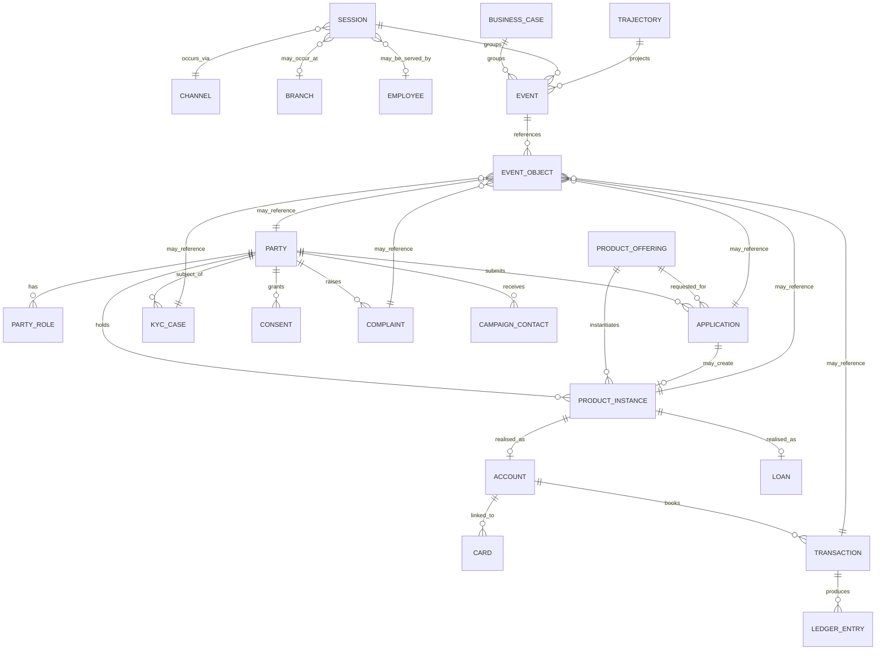
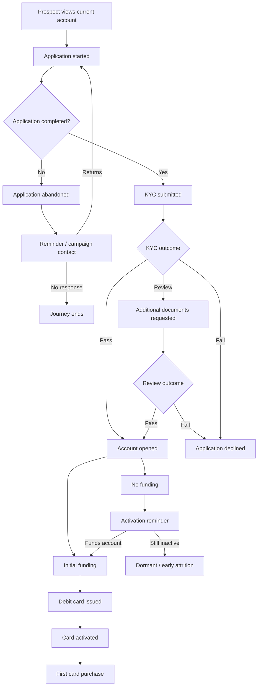

# Building a Banking Customer-Trajectory Dataset for Journeys and Alternative Paths

## Executive summary

The strongest design for a banking trajectory dataset is **not** a single flat “customer journey” table. Banking journeys routinely connect multiple long-lived objects—customer, application, account, card, loan, payment, complaint, KYC case, channel, branch, campaign and transaction—and the same event can belong simultaneously to several of them. A robust architecture should therefore combine **an object-centric domain model with an event log and explicit trajectory projections**. This is consistent with the banking-domain breadth exposed by BIAN, the account/payment semantics of Open Banking and ISO 20022, and the object-centric event-log approach formalised by OCEL 2.0. citeturn17view0turn8view0turn1search2turn15academia33

No public dataset identified in this research provides a complete, longitudinal, multi-product, omnichannel retail-banking journey. The available sources are complementary: UCI Bank Marketing provides campaign/contact outcomes; CFPB complaints provide servicing and complaint cases; HMDA provides mortgage-application outcomes; Freddie Mac provides long-run mortgage performance; and IBM AMLSim provides synthetic account-to-account transaction networks. This means the dataset should be assembled as a **knowledge-and-calibration federation**, not by choosing one seed dataset. citeturn4view0turn4view1turn18view0turn4view3turn6view0

My recommended architecture has four conceptual levels:

1. **Domain ontology** — products, services, channels, entities and permissible relationships, seeded principally from BIAN, Open Banking, ISO 20022 and bank documentation.
2. **Canonical event store** — every observable action/status change becomes a typed event linked many-to-many to banking objects.
3. **Trajectory projection** — events are assembled into sessions, business cases and customer-level journeys according to the analytical question.
4. **Alternative-path layer** — observed prefixes can branch into simulated alternatives generated by constrained rules, semi-Markov/HMM models, agent simulation or generative sequence models.

This separation is important. A mortgage application is a *case* that may last weeks; a mobile-app visit is a *session* lasting minutes; a customer's relationship with the bank is a *trajectory* lasting years. Conflating these concepts will produce misleading sequence models.

For an initial build, I would prioritise **BIAN v14 + UK Open Banking + ISO 20022 + OCEL 2.0** for semantics and structure, then **UCI Bank Marketing + HMDA + Freddie Mac + CFPB complaints + AMLSim** as empirical/synthetic calibration sources. BIAN's public repository currently exposes release 14 semantic APIs in OpenAPI and AsyncAPI formats and is Apache-2.0 licensed; the UK Open Banking standard publishes API specifications and Swagger material; ISO 20022 provides a financial-services repository spanning payments, cards, securities, trade finance and foreign exchange; and OCEL 2.0 explicitly supports evolving object attributes and qualified event-object/object-object relationships. citeturn17view0turn8view0turn1search2turn15academia30

For generation, I recommend a **hybrid constrained semi-Markov architecture** as the first production system: hard domain rules prevent impossible banking states, empirical transition probabilities provide realistic variation, dwell-time models determine when events occur, and optional generative models add high-dimensional behavioural variation. Pure LLM or GAN generation should not be the primary mechanism for balance movements, lifecycle states or regulatory workflows because these require strict invariants. SDV can model tabular, relational and sequential synthetic data, while AMLSim is a useful precedent for explicitly simulated banking-account networks. citeturn20search22turn20search30turn6view0

Validation should have four independent gates: **structural validity, process realism, distributional/utility similarity and disclosure/privacy risk**. NIST's differential-privacy guidance emphasises that privacy loss is mathematically quantifiable but deployment decisions remain contextual; NIST also recommends explicit safeguards for PII. The UK's ICO similarly treats identifiability as a risk spectrum and distinguishes pseudonymisation from effective anonymisation. Consequently, “synthetic” must never automatically be equated with “anonymous”. citeturn12view0turn12view1turn12view2

**Scope qualification:** no bank, country or regulatory regime was specified. The design below is therefore deliberately jurisdiction-neutral, but its seed material includes global standards plus UK and US public sources. Before production use, introduce a `jurisdiction_profile` that controls product taxonomy, regulatory fields, KYC/AML rules, consent states, disclosure constraints and permissible synthetic-data releases. Also, the referenced ChatGPT-session URL itself is not present in the material available to me; the report therefore implements the trajectory/alternative-path objective described in the request rather than relying on unseen session content.

## Banking domain inventory and relationship model

BIAN is particularly useful as the top-level ontology seed because its current landscape decomposes banking capabilities into service domains including branch, contact-centre and e-branch management, while its business-object catalogue includes concepts relating to cards, direct debits, funds and object relationships. BIAN's public v14 repository states that each API specification corresponds to a service domain. citeturn2search2turn0search8turn17view0

UK Open Banking complements this with more concrete external API semantics around accounts, balances, transactions, payments, consent and customer-authorised third-party access. ISO 20022 should then be used below that level for the semantics of financial messages and transaction instructions; its repository is organised around a Data Dictionary and Business Process Catalogue covering domains including payments and cards. citeturn8view0turn1search2

### Products, services, touchpoints and internal objects

| Domain layer | Canonical inventory | Important relationships / trajectory role |
|---|---|---|
| **Party** | Individual customer, prospect, joint holder, household, sole trader, SME, corporate, beneficial owner, guarantor, authorised user, counterparty | `HOLDS`, `OWNS`, `BENEFICIAL_OWNER_OF`, `GUARANTEES`, `AUTHORISED_FOR`, `MEMBER_OF_HOUSEHOLD` |
| **Deposits** | Current/checking account, savings, notice account, money-market deposit, term/fixed deposit/CD, youth/student account | Customer applies for → opens → funds → transacts → becomes dormant/reactivated → closes |
| **Cards & payments** | Debit card, credit card, prepaid card, virtual card, token; transfer, direct debit, standing order, bill payment, remittance, wallet payment | Card `LINKED_TO` account; transaction `USES` card/account; payment instruction `RESULTS_IN` ledger entries |
| **Consumer credit** | Overdraft, personal loan, auto/vehicle finance, mortgage, home-equity product, revolving credit/credit card | Application → credit decision → offer → acceptance → origination → servicing → delinquency/cure → closure |
| **Business banking** | Business current account, business card, term loan, revolving facility, merchant acquiring, cash management | Business/customer → mandates/users → facilities/accounts → payments/receivables |
| **Corporate/transaction banking** | Treasury/cash management, liquidity, trade finance, guarantees, letters of credit, FX, bulk payments | Important if eventual scope expands beyond retail; model as additional product/service classes |
| **Wealth/investment** | Brokerage, custody, advisory, managed portfolio, retirement/pension wrappers where bank-supported | Party → portfolio/account → order/trade → position → cash/security settlement |
| **Ancillary** | Insurance/bancassurance, safe-deposit box, identity services, open-banking/API access | Region and institution dependent; keep taxonomy extensible |
| **Onboarding & identity** | Registration, identity proofing, KYC, customer due diligence, document collection, address verification, sanctions/PEP screening | Prospect → application → KYC case → decision → customer activation |
| **Loan origination** | Application, document verification, affordability, bureau check, underwriting, valuation, approval/decline, offer, closing | Forms a long-lived `case_id`, usually crossing many sessions |
| **Servicing** | Statements, address/preferences, replacement card, limit change, beneficiary management, payment holiday, refinance | Often the source of recurring sub-journeys |
| **Risk/compliance** | AML transaction monitoring, fraud alert, sanctions, enhanced due diligence, dispute investigation | Events may touch party + account + transaction + case simultaneously |
| **CRM/marketing** | Campaign, segment, lead, next-best-action, offer, outbound call/email/push, acceptance, opt-out | UCI Bank Marketing is useful specifically for this layer. citeturn4view0 |
| **Complaints/support** | Enquiry, service request, complaint, escalation, remediation, resolution | CFPB's complaint schema is useful for product/issue/channel/outcome taxonomies. citeturn4view1 |
| **Digital touchpoints** | Mobile app, online banking, public website, chatbot, push, email, SMS | Produce short interaction sessions that link to longer business cases |
| **Physical/human touchpoints** | Branch, ATM, relationship manager, adviser, call centre, IVR, back-office operator | BIAN explicitly contains branch/contact-centre service domains. citeturn2search2 |
| **External/network** | POS/e-commerce merchant, ATM network, card network, clearing scheme, payment rail, credit bureau, identity provider, open-banking TPP | External entity should be represented even when only an opaque identifier is available |
| **Operational objects** | Customer/party, account, card, loan, application, payment instruction, transaction, ledger entry, balance, statement, document, consent, case, alert, complaint, branch, employee, channel, device, campaign | These are the objects to which events attach |

A crucial distinction is between **product offering** and **product instance**. “Premium Current Account” is an offering with eligibility rules, pricing and features; account `ACC-7F…` is a customer's instance. The same applies to a mortgage product versus a specific loan, or a credit-card proposition versus a specific card/account. Keeping them separate allows a bank's product catalogue to change without rewriting customer history.

Likewise, model **transaction instruction**, **transaction**, and **ledger entry** separately. A payment request can fail before posting; a posted payment can generate several ledger movements; reversals and chargebacks can create new movements rather than deleting history. ISO 20022's process/data-dictionary architecture is a useful semantic basis for this separation. citeturn1search2

### Recommended entity-relationship structure



This deliberately follows an **object-centric** rather than strictly case-centric structure. Traditional process-event data normally revolve around case ID, activity and timestamp; OCEL 2.0 extends that approach to multiple interacting objects, evolving object attributes and qualified object relationships, making it unusually well suited to banking. citeturn13search20turn15academia30turn15academia33

### Relationship catalogue

The relationship layer should itself be temporal. For example, a customer may be authorised on an account from January to June, a card may be attached to an account until replacement, and a relationship manager may cover a customer only during one period. Recommended relation records therefore contain:

`relationship_id, subject_id, predicate, object_id, valid_from, valid_to, recorded_at, source, confidence`.

Core predicates should include:

`HOLDS`, `JOINTLY_HOLDS`, `OWNS`, `AUTHORISED_FOR`, `LINKED_TO`, `SECURED_BY`, `GUARANTEES`, `APPLIED_FOR`, `RESULTED_IN`, `INITIATED_VIA`, `PROCESSED_BY`, `SERVED_AT`, `TARGETED_BY`, `OFFERED`, `CONSENTED_TO`, `COUNTERPARTY_OF`, `DISPUTES`, `RELATED_TO_CASE`, and `SUPERSEDES`.

This is effectively a temporal banking knowledge graph, while the event table captures behaviour.

## Seed datasets, schemas and benchmarks

The table below prioritises sources by their value to this specific trajectory problem, not merely by dataset size. Public banking datasets are fragmented by design and regulation, so **coverage complementarity is more important than finding the largest dataset**.

| Priority | Dataset / standard | Source URL | Scope and approximate size | Licence / access | Useful fields | Suitability |
|---|---|---|---|---|---|---|
| **A** | **BIAN Semantic APIs / Service Landscape v14** | `https://github.com/bian-official/public` | Banking reference architecture; schema rather than observations; release 14 includes OAS 3.x and AsyncAPI artefacts | Apache-2.0 for the public repository | Service domains, operations, business objects, API request/response structures | **Best ontology backbone.** Use for product/service capabilities and canonical entity naming, not behavioural probability calibration. citeturn17view0 |
| **A** | **UK Open Banking Standard** | `https://standards.openbanking.org.uk/` | API specifications rather than customer observations | Public standard/specifications; check applicable Open Banking terms before redistribution of artefacts | Account, balance, transaction, payment, consent, party/API structures; Swagger material | **Best seed for operational retail account/payment APIs** and consent-based interactions. Standard site explicitly provides technical docs, examples and Swagger/API specifications. citeturn8view0 |
| **A** | **ISO 20022 Repository** | `https://www.iso20022.org/` | Global financial-message repository; N/A row count | ISO copyrighted standard; repository/catalogue resources accessible, formal ISO material subject to ISO licensing | Message concepts, payments, cards, securities, FX, trade finance, business-process/data-dictionary semantics | **Best payment/message semantic dictionary**; do not treat it as a customer-journey dataset. citeturn1search2turn1search10 |
| **A** | **OCEL 2.0** | `https://www.ocel-standard.org/` | Object-centric event-log specification; N/A row count | Public specification/resources; check individual artefact licences | Events, objects, event-object relationships, object-object relationships, evolving attributes | **Excellent structural template** for the multi-object event layer. Supports SQLite, XML and JSON exchange forms. citeturn15academia30turn15academia33 |
| **A** | **UCI Bank Marketing** | `https://archive.ics.uci.edu/dataset/222/bank+marketing` | Portuguese bank direct-marketing campaigns; 45,211 observations in the classic dataset; an additional version has 41,188 observations and 20 inputs | CC BY 4.0 | Demographics, balance/loans, contact channel, month/day, duration, campaign contacts, previous outcome, term-deposit subscription | **Excellent small initial journey benchmark** for contact→decision sequences and marketing response. Weak for transactions and full lifecycle. citeturn4view0 |
| **A** | **HMDA Modified Loan Application Register** | `https://ffiec.cfpb.gov/data-publication/modified-lar` | US mortgage applications; 2025 release covers approximately 4,768 reporting filers and a combined national loan-level file; millions of applications occur annually | Public regulatory data, modified for consumer privacy; no generic OSS licence should be inferred | Application/loan characteristics, action/outcome, lender, borrower attributes, geography, pricing and denial-related fields | **Excellent origination-case calibration:** application→decision/origination/withdrawal. Not a servicing or interaction log. citeturn18view0turn18view1 |
| **A** | **Freddie Mac Single-Family Loan-Level Dataset** | `https://www.freddiemac.com/research/datasets/sf-loanlevel-dataset` | Approximately **56 million mortgages** originated 1999–31 Mar 2026, with performance through 31 Mar 2026 | Free under stated terms for non-commercial/academic/research/limited use; commercial redistribution/use may require licensing | Origination attributes, monthly performance, prepayment, foreclosure alternatives, REO/loss components, delinquency-related information | **Best public seed here for long-lived loan trajectories and dwell-time/hazard calibration.** US mortgage-specific. citeturn4view3 |
| **A** | **IBM AMLSim** | `https://github.com/IBM/AMLSim` | Configurable synthetic banking transaction simulator; sample/configuration sizes are user controlled | Apache-2.0 | Accounts, parties, organisations/individuals, transactions, cash transactions, alerts/SAR mappings, simulation step/base date | **Best directly reusable simulator seed** for transaction-network trajectories and AML patterns. AML-centric, so do not use its behavioural distribution as generic retail banking truth. citeturn6view0 |
| **B** | **CFPB Consumer Complaint Database** | `https://www.consumerfinance.gov/data-research/consumer-complaints/` | Dynamic, continuously updated collection rather than a fixed N; downloadable/API-accessible | Public US-government dataset; record dataset/legal terms at snapshot time rather than assuming an OSS licence | Date, product/sub-product, issue/sub-issue, channel, company, geography, complaint narrative where published, company response and timeliness | **Excellent service-failure/complaint case taxonomy.** CFPB cautions that the database is not a statistically representative sample. citeturn4view1 |
| **B** | **Open Bank Project API** | `https://github.com/OpenBankProject/OBP-API` | Open-source banking API platform; schema/code rather than representative customers | AGPL-3.0 plus commercial licensing option | Banks, accounts, transactions, counterparties, payments, metadata, authentication/entitlements | Valuable executable/open schema and sandbox basis. Repository explicitly supports accounts, transactions, counterparties and payments. citeturn17view1 |
| **B** | **Financial Data Exchange API** | `https://financialdataexchange.org/` | North-American consumer-permissioned financial-data standard; public FDX page identifies v6.4, released June 2025, as the latest release surfaced by its public resource material | FDX licensing terms; organisation describes the interoperable standard as royalty-free, while some implementation/documentation resources are member-access | Account and consumer-permissioned financial-data exchange concepts | Good North-American open-finance cross-check, but less convenient as an unrestricted seed artefact than BIAN/OBP. citeturn9search0turn9search24turn9search15 |
| **B** | **Federal Reserve Survey of Consumer Finances** | `https://www.federalreserve.gov/econres/scf-documentation.htm` | Triennial US household survey; public 2022 files and codebook | Public-use files; separate confidential-data access exists for approved researchers | Asset/debt ownership, financial accounts, mortgages, credit, income, demographic and household characteristics | **Useful for portfolio/product-holding priors**, not event trajectories. The Fed provides public data, variable definitions, questionnaire/codebook and asset/debt relationships. citeturn14search6turn14search15 |

### How these sources fit together

A useful mental model is:

**ontology → API semantics → event structure → empirical calibration**

- **BIAN** says *what banking capabilities and business objects exist*. citeturn17view0
- **Open Banking / ISO 20022 / OBP** say *what many account, transaction and payment records look like*. citeturn8view0turn1search2turn17view1
- **OCEL** says *how multiple objects can participate in an event log*. citeturn15academia33
- **UCI/HMDA/Freddie/CFPB** provide empirical distributions for selected stages of real banking journeys. citeturn4view0turn18view0turn4view3turn4view1
- **AMLSim** supplies an executable synthetic-network starting point. citeturn6view0

The public-data gap itself is informative: **the synthetic generator should not be trained as one opaque model on one dataset.** Each source should calibrate only the dimensions for which it is genuinely informative.

## Canonical trajectory schema and source mappings

### Separate objects, events, sessions, cases and trajectories

I recommend six canonical physical tables rather than one denormalised master table.

| Table | Grain | Essential attributes |
|---|---|---|
| `objects` | One version of a banking object | `object_id`, `object_type`, `subtype`, `valid_from`, `valid_to`, `attributes_json`, `source_system`, `pii_class` |
| `relationships` | One temporal object-object link | `relationship_id`, `subject_id`, `predicate`, `object_id`, `valid_from`, `valid_to`, `source`, `confidence` |
| `events` | One business occurrence | `event_id`, `event_type`, `event_time`, `recorded_at`, `effective_time`, `timestamp_precision`, `status`, `amount`, `currency`, `channel_id`, `case_id`, `session_id`, `source_system`, `source_record_id` |
| `event_objects` | One event-object association | `event_id`, `object_id`, `object_role`, `qualifier` |
| `trajectories` | One analytical/simulated path | `trajectory_id`, `root_party_id`, `trajectory_type`, `start/end`, `observed_or_synthetic`, `parent_trajectory_id`, `branch_event_id`, `generator_id`, `weight/probability` |
| `state_transitions` | One derived/intrinsic state change | `event_id`, `object_id`, `state_dimension`, `state_before`, `state_after`, `reason`, `confidence` |

The `event_objects` bridge is essential. A single `card.purchase.authorised` event can reference the **customer, card, card account, transaction, merchant and device** without duplicating the event six times. That follows the motivation behind object-centric process data: traditional single-case flattening loses the interactions between multiple participating objects. citeturn15academia30turn15academia33

### Event taxonomy

Use a controlled namespace rather than unconstrained event names:

```text
customer.prospect_created
customer.registered
session.started
product.viewed
offer.presented
offer.accepted

application.started
application.submitted
application.abandoned
application.approved
application.declined
application.withdrawn

kyc.started
kyc.document_submitted
kyc.review_required
kyc.passed
kyc.failed

account.opened
account.funded
account.dormant
account.reactivated
account.closed

card.ordered
card.issued
card.activated
card.purchase_authorised
card.purchase_declined
card.blocked
card.replaced

payment.initiated
payment.authorised
payment.rejected
payment.settled
payment.reversed

transaction.pending
transaction.posted
transaction.reversed

loan.offer_created
loan.originated
loan.payment_due
loan.payment_received
loan.delinquent
loan.cured
loan.modified
loan.prepaid
loan.defaulted
loan.closed

fraud.alert_created
aml.alert_created
aml.case_opened
aml.case_closed

service.request_created
complaint.received
complaint.escalated
complaint.resolved
```

Store both `event_type_canonical` and `event_type_raw`. The latter prevents ontology upgrades from destroying source fidelity.

### Time model

Bank data require more than one timestamp:

- `event_time`: when the business event happened.
- `effective_time`: when its financial/legal effect begins, if different.
- `recorded_at`: when the source system recorded it.
- `ingested_at`: when the trajectory platform received it.
- `valid_from/valid_to`: temporal validity for objects and relationships.
- `timestamp_precision`: `second | minute | day | month | sequence_only | unknown`.
- `timezone`: explicit IANA zone or UTC-normalised source metadata.

This effectively gives the model **business time plus system/record time**. It avoids a common error such as interpreting a transaction's posting timestamp as the exact time the customer initiated it.

Never invent precision when mapping public data. A UCI campaign record containing only month/day-level information should remain coarse. “Synthetic exact timestamp” is permissible only in a synthetic derivative and must be marked as such.

### Session, case and trajectory semantics

```text
session_id
    = one contiguous interaction episode
      e.g. mobile login → account view → payment → logout

case_id
    = one business objective/work item
      e.g. mortgage application, dispute, KYC review

trajectory_id
    = selected projection across sessions/cases/objects
      e.g. acquisition-to-first-90-days journey
```

For digital activity, a **30-minute inactivity threshold** is a defensible *starting experiment*, not a banking standard. Optimise it against the empirical inter-event-time distribution. A telephone call naturally supplies its own session boundary; a mortgage case should not be broken merely because two interactions are separated by days.

### Product and customer state machines

Use multiple orthogonal state dimensions rather than one gigantic status field:

```text
relationship_state:
  prospect → applicant → customer → inactive → former_customer

kyc_state:
  not_started → pending → verified
                      ↘ review_required → verified
                                       ↘ failed

application_state:
  started → submitted → under_review → approved → accepted → completed
                               ↘ declined
             ↘ abandoned
                         ↘ withdrawn

account_state:
  pending → active → dormant → restricted → closed

credit_state:
  current → past_due → delinquent → cured
                    ↘ defaulted → charged_off/foreclosed
```

Different products should specialise these generic machines. For example, mortgages can add appraisal, underwriting, closing and modification states; cards can add manufactured, delivered, activated, frozen and replaced states.

### Source-to-canonical mapping

| Source | Objects created | Event mapping | Important mapping rule |
|---|---|---|---|
| UCI Bank Marketing | `party_segment`, `campaign`, `product_offering(term_deposit)` | `campaign.contact`, `campaign.previous_outcome`, `offer.accepted/declined` | Preserve campaign/contact count and previous outcome; do **not** infer a complete account history from marketing attributes. citeturn4view0 |
| CFPB Complaints | `complaint_case`, `product_category`, `company`, coarse party/geography if appropriate | `complaint.received`, `complaint.sent_to_company`, `complaint.responded/resolved` where fields support them | Narrative must be treated as potentially sensitive unstructured data. Database is not representative of all customers or institutions. citeturn4view1 |
| HMDA | `mortgage_application`, `lender`, `property`, applicant profile, requested loan | `application.received`, `application.action_taken`, then canonicalise action to approved/originated/declined/withdrawn/etc. | One regulatory row is a case summary, not evidence of every underwriting step. Add intermediate events only through explicitly labelled simulation. citeturn18view0turn18view1 |
| Freddie Mac | `mortgage_loan`, borrower/loan attributes, performance snapshots | `loan.originated`, monthly status transitions, `loan.delinquent`, `loan.prepaid`, foreclosure/modification/recovery events when supported | Derive transitions from consecutive performance states rather than treating every monthly snapshot as independent. citeturn4view3 |
| AMLSim | `party`, `account`, transaction, alert/case entities | Transaction/cash events and AML-pattern/alert events | Direct fit to event graph; keep AML scenario labels separately from ordinary retail transaction behaviour. citeturn6view0 |
| Open Banking | `party`, `account`, `balance`, transaction, payment/consent objects | Translate API resource changes/actions into account/payment/consent events | Retain native API identifiers only in protected source mapping; canonical dataset gets surrogate IDs. citeturn8view0 |
| BIAN | Ontology/service-domain concepts | Map operations/control records to canonical domain and event types | Primarily semantic normalisation rather than empirical observations. citeturn17view0 |
| ISO 20022 | Payment/financial instruction concepts | Normalise message and transaction semantics | Preserve original message/status codes alongside canonical vocabulary. citeturn1search2 |

### Non-negotiable mapping rules

**Identity resolution must precede trajectory assembly.** Create canonical surrogate identifiers and maintain source-key mappings in a restricted identity vault. Never infer that two people are identical merely because demographic attributes match.

**Facts and inference must be distinguishable at field level.** Recommended lineage fields are:

```text
observation_status = observed | derived | imputed | simulated
derivation_method
source_dataset
source_record_id
mapping_version
mapping_confidence
generator_version
```

**Preserve raw values.** Canonicalisation should add `canonical_status="declined"` while retaining something such as `source_action_code="3"`.

**Money needs explicit units.** Every monetary field requires amount, ISO currency, sign convention and the semantic role of the amount. Do not let `-100` ambiguously mean debit in one source and credit in another.

**Deduplication must be idempotent.** Prefer source-event IDs where available; otherwise construct a deterministic fingerprint from source, object, event type, time and stable payload fields.

**Unobserved events are not negative observations.** Absence of a branch event in a mobile dataset does not mean no branch interaction occurred.

### Sample trajectory with alternatives



This diagram should not be interpreted as one universal bank process. It is the kind of **permitted transition graph** the generator would derive from documented workflows and empirical observations.

A normalised example dataset could look as follows:

| trajectory_id | parent | event_time | session / case | event_type | object(s) | channel | pre → post state | amount | status |
|---|---|---|---|---|---|---|---|---:|---|
| T100 | — | 2026-01-03 09:00 | S01 | `product.viewed` | P001, OFFER01 | web | prospect → prospect | — | synthetic |
| T100 | — | 2026-01-03 09:04 | S01/C01 | `application.started` | P001, APP01 | web | none → started | — | synthetic |
| T100 | — | 2026-01-03 09:13 | S01/C01 | `application.submitted` | APP01 | web | started → submitted | — | synthetic |
| T100 | — | 2026-01-03 09:15 | S01/C01 | `kyc.started` | P001, KYC01 | web | none → pending | — | synthetic |
| T100 | — | 2026-01-03 09:16 | S01/C01 | `kyc.passed` | P001, KYC01 | system | pending → verified | — | synthetic |
| T100 | — | 2026-01-03 09:17 | C01 | `account.opened` | P001, ACC01 | system | pending → active | — | synthetic |
| T100 | — | 2026-01-04 18:20 | S02 | `account.funded` | ACC01, TX01 | mobile | active → active | 1,250 GBP | synthetic |
| T100 | — | 2026-01-06 11:00 | C01 | `card.issued` | ACC01, CARD01 | system | none → issued | — | synthetic |
| T100 | — | 2026-01-08 19:12 | S03 | `card.activated` | CARD01 | mobile | issued → active | — | synthetic |
| T100 | — | 2026-01-08 20:03 | — | `card.purchase_authorised` | CARD01, ACC01, TX02 | POS | active → active | 26.40 GBP | synthetic |
| T100-A | T100 | 2026-01-03 09:16 | C01 | `kyc.review_required` | P001, KYC01 | system | pending → review | — | alternative |
| T100-A | T100 | 2026-01-04 12:00 | C01 | `kyc.document_submitted` | KYC01, DOC02 | mobile | review → review | — | alternative |
| T100-A | T100 | 2026-01-05 15:30 | C01 | `kyc.passed` | P001, KYC01 | back office | review → verified | — | alternative |
| T100-B | T100 | 2026-01-03 09:13 | C01 | `application.abandoned` | APP01 | web | started → abandoned | — | alternative |
| T100-B | T100 | 2026-01-05 10:00 | — | `campaign.contact` | P001, CAMP09 | email | abandoned → abandoned | — | alternative |

The alternative records should also contain at least `branch_event_id`, `generator_method`, `generator_probability` and `constraint_check_status`.

## Generating and validating alternative trajectories

### Generation strategy

Calling every simulated alternative a “counterfactual” would be scientifically too strong. A path such as “customer received a reminder rather than no reminder and subsequently completed the application” is a **simulated alternative** unless the model supports causal identification of the intervention. Reserve `counterfactual=true` for trajectories backed by a causal model or defensible intervention assumptions.

The main methods compare as follows.

| Method | How it works | Advantages | Limitations | Suggested starting parameters |
|---|---|---|---|---|
| **Rule/state-machine generation** | Traverse allowed state graph under eligibility/guard rules; sample event times/outcomes from configured distributions | Perfect controllability; transparent; prevents impossible states; works with little data | Behaviour can look mechanical; hand-maintenance burden; correlations can be missed | Mandatory/forbidden transitions; product-specific guards; max repeat counts; empirical/log-normal/Weibull dwell-time distributions |
| **Markov / semi-Markov** | Estimate `P(next_state \| state, context)`; semi-Markov adds state-dependent duration | Simple, interpretable, easy to calibrate and inspect | First-order Markov loses long history; sparse segments lead to unstable transitions | Prefer semi-Markov; condition on product/segment/channel; test Dirichlet smoothing α ∈ {0.1, 0.5, 1}; back off hierarchical levels when support is small |
| **Hidden Markov Model** | Observed events emitted by latent behavioural states such as intent, engagement or distress | Captures unobserved journey modes; compact | Hidden states may lack business interpretation; state count/model assumptions matter | Start 4–12 latent states; select with held-out likelihood/BIC plus interpretability; model durations explicitly if necessary |
| **Agent-based/discrete-event simulation** | Customers, bank agents, queues/channels and environment interact according to behavioural policies | Excellent for “what if bank changes policy/capacity?”; captures feedback, waiting and resource contention | High calibration burden; many degrees of freedom; can create plausible-looking but unsupported behaviour | Calibrate arrival rate, propensity, service time, queues, budgets, life-event rates and policy response; perform parameter sensitivity rather than one fixed setting |
| **Tabular GAN/VAE/copula** | Learn joint attribute distributions and generate rows or linked tables | Useful for customer/product profiles and conditional attributes | Does not inherently guarantee valid event sequences | Use after structural variables are defined; enforce relational/lifecycle constraints afterwards. CTGAN was specifically developed for mixed discrete/continuous tabular distributions. citeturn20academia35 |
| **Sequence GAN / transformer / diffusion-style generator** | Learn conditional sequence distribution over events and times | Captures long context, high-dimensional dependencies and diverse paths | Data hungry; difficult to guarantee constraints; memorisation/privacy risk; hard to explain | Tokenise event type separately from attributes; begin with 32–128-event context; condition on segment/product/outcome; reject/repair invalid generations |
| **Hybrid constrained generator — recommended** | Rules define feasible graph; probabilistic/generative model chooses among feasible transitions and attributes | Best balance of control, realism, explainability and diversity | More engineering than a single end-to-end model | Hard constraints first; semi-Markov baseline; neural residual model only where baseline leaves substantial unexplained dependence |

SDV currently provides single-table, multi-table and sequential synthetic-data capabilities and supports constraints/anonymisation as part of synthetic workflows, making it useful for profile and secondary sequence generation. citeturn20search22turn20search30

AMLSim demonstrates the complementary simulation approach: accounts/parties and transactions are generated under explicit simulation parameters, with known AML patterns and associated account/alert outputs. citeturn6view0

### Recommended hybrid algorithm

For each observed or synthetic customer profile:

```text
1. Sample/inherit a starting state and portfolio.
2. Select an objective:
      open_account | make_payment | borrow | seek_support | etc.
3. Instantiate the relevant product/case state machine.
4. Find all next events satisfying hard constraints.
5. Estimate transition probabilities conditional on:
      current state
      preceding k events
      product
      customer segment
      channel
      calendar/time
      portfolio state
6. Sample the next transition.
7. Sample dwell time conditional on transition/state.
8. Generate attributes:
      amount, channel, outcome, device, merchant class, etc.
9. Recompute account/product state.
10. Check invariants.
11. Repeat until terminal state/horizon.
12. Optionally branch at designated decision points.
```

For alternative trajectories, maintain a **common prefix** and branch only after the selected intervention/decision:

```text
trajectory_id          T-123-ALT-02
parent_trajectory_id   T-123
branch_event_id        E-047
intervention           "offer.credit_limit = lower"
generator              semi_markov_v3
path_probability       0.083
causal_claim            false
```

Generate several alternatives rather than only the modal path. For example, retain the top plausible path, multiple stochastic samples and one or more rare-but-valid paths. This creates a trajectory set suitable for ranking, planning and stress testing rather than merely reproducing the historical future.

### Validation framework

Process mining is particularly valuable here because it directly tests event sequences against process models. Conformance checking compares observed behaviour to process behaviour; token replay and alignment are established mechanisms for computing deviations/fitness. citeturn13search12

| Validation family | Metrics | Proposed acceptance approach |
|---|---|---|
| **Schema/integrity** | Referential-integrity rate, uniqueness, missing mandatory fields, invalid enum rate | 100% referential integrity for released canonical records |
| **Lifecycle validity** | Invalid transition rate, events after closure, activation before issuance, payment before account existence | Target **zero impossible transitions**; explicitly labelled exception classes can be whitelisted |
| **Temporal realism** | Inter-event-time distribution, session duration P50/P90/P99, dwell times, seasonality, time-of-day profile | Compare by product/channel/segment, not just globally |
| **Marginal similarity** | Jensen–Shannon divergence for categorical distributions; KS/Wasserstein-type distances for continuous distributions | Establish dataset-specific baseline; flag large deviations at segment level |
| **Dependence similarity** | Correlation/association matrices, conditional distributions, mutual information, multivariate distance/MMD | Ensure plausible dependencies such as channel × age/segment or payment amount × account type |
| **Sequence similarity** | Transition-matrix distance, event n-gram coverage, longest-common subsequences, path length distribution | Measure both fidelity and novelty |
| **Process mining** | Trace fitness, precision, alignment cost, discovered process variants | Generator must cover realistic variants without enabling many unsupported paths. Process-mining conformance is designed for comparison between observed traces and a process model. citeturn13search12 |
| **Rare-path coverage** | Frequency and support of fraud, delinquency, KYC review, abandonment, complaint escalation | Validate separately because global metrics hide rare journeys |
| **Predictive utility** | Train-on-synthetic/test-on-real and real-versus-synthetic downstream task performance | Compare feature rankings/calibration as well as AUC/F1 |
| **Population utility** | Product ownership, balances, credit states and customer segments | Use sources such as SCF only for variables where their sampling frame is appropriate. citeturn14search6turn14search15 |
| **Privacy** | Exact-match/duplicate rate, nearest-neighbour distance, membership-inference performance, attribute inference, quasi-identifier uniqueness | Must pass separately from statistical similarity; realism alone says nothing about privacy |
| **Fairness** | Outcome/transition rates and error/utility metrics across relevant protected groups | Apply where permitted and appropriate; do not “wash away” real disparities merely to optimise similarity |

A useful validation hierarchy is:

**hard invariant → trajectory/process validity → conditional statistical fidelity → downstream utility → privacy → human/domain review**.

Do not reverse it. A synthetic dataset can achieve attractive marginal histograms while containing impossible loan or card histories.

### Privacy and synthetic-data design

NIST SP 800-226, published in 2025, describes differential privacy as a mathematical framework for quantifying privacy loss associated with the participation of an entity in a dataset and emphasises hazards and practical deployment considerations. There is consequently **no universal ε that should be copied into a banking project without a threat model and privacy-budget decision**. citeturn12view0

Recommended policy:

**Separate identity from analytics.** Raw names, addresses, telephone numbers, emails, national identifiers, account numbers, card PANs and exact externally resolvable identifiers should live outside the trajectory layer. Use randomly generated canonical IDs or securely keyed tokens. NIST's PII guidance calls for context-aware identification and safeguards against inappropriate access, use and disclosure. citeturn12view1

**Define privacy contribution at the person or household level, not event-row level.** One customer may contribute thousands of transactions. A privacy mechanism calibrated as though each transaction were an independent person can materially understate exposure.

**Use differential privacy where formal release protection is required.** Candidate approaches include DP-calibrated aggregate distributions and DP-trained generative models. During research, evaluate several budgets—for example ε values across `0.5, 1, 2, 4, 8`—only as a *sensitivity experiment*, not as pre-approved release thresholds. Final budget selection should follow threat modelling, contribution bounds and utility analysis. NIST's practical guidance is specifically concerned with implementation choices and hazards. citeturn12view0

**Use k-anonymity-like checks as diagnostics, not as the security claim.** Measure quasi-identifier equivalence-class sizes, uniqueness and rare combinations; also consider diversity of sensitive attributes inside equivalence classes. These techniques do not substitute for a formal privacy guarantee or attack testing.

**Suppress or generalise high-risk information.** Convert exact birth dates to age bands where detailed age is unnecessary, exact location to suitable geography, and very rare categories to controlled “other” values. Timestamp rounding/jittering may be appropriate for publication, but it must preserve logical ordering.

**Attack the synthetic output.** Run nearest-neighbour, membership-inference and attribute-inference tests and inspect exact or near-exact reproductions. OpenDP maintains resources specifically concerned with output-privacy attacks and responsible DP deployment. citeturn21search6turn21search2

**Do not confuse pseudonymisation with anonymisation.** The ICO's anonymisation guidance discusses identifiability, re-identification risk, pseudonymisation and governance explicitly; pseudonymised information can remain identifiable information. citeturn12view2

## Documentation extraction, ontology enrichment and governance

A large fraction of the desired bank-specific ontology will eventually come from the bank itself rather than public datasets. The extraction system should therefore be designed as a repeatable **documentation-to-knowledge-graph pipeline**.

### Source acquisition priority

Use sources in descending authority:

**Machine-readable API definitions first.** OpenAPI/Swagger, AsyncAPI, JSON/XML schema and API examples often expose entities, IDs, enums, lifecycle actions, cardinalities and request/response relationships directly. BIAN's v14 repository demonstrates this approach with OAS and AsyncAPI artefacts, while UK Open Banking publishes technical/API specification material and Swagger files. citeturn17view0turn8view0

**Product catalogue and legal product documentation second.** Product pages, pricing/fee schedules, eligibility criteria, terms and conditions, product disclosure documents and application guides reveal offerings, feature dependencies and customer-facing transitions.

**Service/help journeys third.** “How to activate your card”, “replace a card”, “dispute a transaction”, “apply for an overdraft”, or “close an account” pages are exceptionally useful because verbs frequently translate directly into events and state transitions.

**Regulatory filings and structured disclosures fourth.** Annual reports, regulatory returns and relevant regulatory product/market datasets help identify products, business segments, operational entities and volumes. Regulatory sources are jurisdiction-specific, which is why the project needs a jurisdiction configuration rather than hard-wiring one regulatory vocabulary.

### Extraction pipeline

```text
Document discovery
      ↓
Versioned acquisition
(URL, timestamp, hash, jurisdiction, document type)
      ↓
Parser
HTML | OpenAPI | AsyncAPI | JSON/XML | XBRL | PDF/table parser
      ↓
Structural chunking
heading → subsection → paragraph/table/API operation
      ↓
Candidate extraction
rules + NER + schema parser
      ↓
Entity normalisation
bank term → canonical banking concept
      ↓
Relation extraction
(subject, predicate, object, qualifiers)
      ↓
Event/state extraction
precondition → action → outcome → post-state
      ↓
Evidence binding
source anchor + evidence text + confidence
      ↓
Constraint validation
schema + ontology + lifecycle rules
      ↓
Human review queue
      ↓
Versioned banking knowledge graph
```

For PDF documents with tables, diagrams or page-layout semantics, visual/page-aware extraction is preferable to blindly concatenating extracted text.

### NLP/information-extraction design

Use a combination rather than relying exclusively on an LLM:

**Deterministic parsing** for OpenAPI operations, endpoints, schema names, `$ref` relationships, enums and required fields.

**Dictionary/rule matching** for well-defined finance terms such as current account, overdraft, APR, debit card, standing order, KYC and chargeback.

**NER** for `PRODUCT`, `SERVICE`, `FEE`, `CHANNEL`, `ELIGIBILITY_RULE`, `DOCUMENT`, `ACTOR`, `STATE`, `EVENT`, `TIME_CONSTRAINT`, `AMOUNT`, `CURRENCY`, `JURISDICTION`.

**Relation extraction** for patterns such as:

```text
PRODUCT --HAS_FEE--> FEE
PRODUCT --REQUIRES--> ELIGIBILITY_RULE
CARD --LINKED_TO--> ACCOUNT
EVENT --TRANSITIONS--> STATE
APPLICATION --RESULTS_IN--> ACCOUNT
CUSTOMER --MUST_PROVIDE--> DOCUMENT
SERVICE --AVAILABLE_VIA--> CHANNEL
```

**Coreference resolution** is needed because documentation frequently introduces “the account” and subsequently refers to “it”, or introduces a card product and later uses “your card”.

**Ontology/entity linking** should map local wording onto BIAN/Open Banking/ISO-aligned concepts while preserving the bank's local label. BIAN provides the broad banking service-domain structure; Open Banking and ISO provide more operational resource/message semantics. citeturn17view0turn8view0turn1search2

**LLM structured extraction** should be constrained to a JSON schema and forced to return documentary evidence and confidence. Records without source evidence should not enter the “observed bank knowledge” layer.

### Example extraction prompts

A product-extraction prompt:

```text
You are extracting a banking product catalogue from an authoritative bank document.

Return only JSON conforming to the supplied schema.

For each product, identify:
- source_product_name
- canonical_product_family
- customer_segment
- currencies
- eligibility_requirements
- fees
- interest/pricing concepts
- associated services
- available channels
- linked/required products
- lifecycle states explicitly mentioned
- customer or bank actions explicitly mentioned
- jurisdiction
- effective date, if stated
- source evidence span
- source section/page
- confidence: 0..1

Rules:
1. Do not infer a product, feature, fee, eligibility rule, relationship or state
   that is not supported by the source.
2. Separate explicit facts from inferred mappings.
3. Preserve the exact source terminology in `source_*` fields.
4. Map to the canonical ontology only in `canonical_*` fields.
5. For ambiguous statements, set confidence < 0.7 and explain the ambiguity.
```

A relationship/state-transition prompt:

```text
Extract banking relationships and lifecycle transitions from this documentation.

For each fact return:
{
  "subject_type": "...",
  "subject": "...",
  "predicate": "...",
  "object_type": "...",
  "object": "...",
  "preconditions": [],
  "event": null,
  "state_before": null,
  "state_after": null,
  "channel": null,
  "time_constraint": null,
  "jurisdiction": null,
  "evidence": "...",
  "confidence": 0.0
}

Allowed predicates include:
HAS_FEATURE, REQUIRES, AVAILABLE_VIA, LINKED_TO, ELIGIBLE_FOR,
INITIATES, RESULTS_IN, TRANSITIONS_TO, PROHIBITS, CHARGES_FEE.

Do not convert recommendations or examples into mandatory rules.
Do not fill missing lifecycle stages from general banking knowledge.
```

A trajectory-rule extraction prompt:

```text
Given the following product/service documentation, construct only the
state transitions explicitly supported by the document.

For each transition identify:
- triggering actor
- trigger/event
- source state
- target state
- required conditions
- optional conditions
- failure outcomes
- alternative outcomes
- timing constraints
- referenced objects
- evidence anchor

Then classify the transition:
EXPLICIT | STRONGLY_IMPLIED | NOT_SUPPORTED

Only EXPLICIT transitions may enter the hard-rule generator automatically.
STRONGLY_IMPLIED transitions require human approval.
```

That last rule is particularly important: a generative model's general knowledge of banking must never silently become “the bank's documented process”.

### Evidence and version governance

Every extracted ontology fact should carry:

```text
fact_id
source_url
source_document_hash
retrieved_at
effective_from/effective_to
source_section/page/API_path
evidence_span
extractor_version
mapping_version
confidence
review_status
reviewer
```

A changed product page then creates a new fact version rather than rewriting the past. This allows the trajectory generator to answer historically meaningful questions such as “what path was available under the product rules in force in June 2025?”

## Deliverables, transformation pipeline and recommended toolchain

### End-state deliverables

A rigorous first release should produce a coherent package rather than one CSV:

| Deliverable | Contents |
|---|---|
| **Banking ontology** | `entity_types.yaml`, `product_taxonomy.csv`, `service_taxonomy.csv`, `relationship_types.yaml` |
| **Event specification** | `event_taxonomy.yaml`, event attributes, lifecycle rules, state machines |
| **Canonical schemas** | JSON Schema/SQL/Parquet definitions for objects, relationships, events, event-object links, states and trajectories |
| **Source registry** | Dataset URL, snapshot, licence/terms, fields, jurisdiction, provenance and permitted use |
| **Mapping catalogue** | One documented transform from each source field/value to canonical concepts |
| **Seed canonical dataset** | Normalised slices of the selected public sources rather than raw source copies |
| **Trajectory-builder package** | Identity/object resolution, case construction, sessionisation, sequencing and trajectory projections |
| **Generator package** | Rule engine, semi-Markov baseline, optional HMM/agent/neural generators |
| **Alternative-path dataset** | Parent/common-prefix metadata, branch reason, model probability and provenance |
| **Validation suite** | Schema, process, statistical, utility, privacy and fairness reports |
| **Documentation IE pipeline** | Document snapshots, extracted entities/relations, evidence anchors and review queue |
| **Data/model cards** | Scope, jurisdiction, intended use, limitations, licences, privacy decisions and known biases |

### Transformation pipeline

The recommended execution order is:

```mermaid
flowchart LR
    A[Public datasets] --> D[Raw immutable landing zone]
    B[Bank APIs/docs] --> D
    C[Standards / schemas] --> D

    D --> E[Parse + profile + licence registry]
    E --> F[Canonical entity mapping]
    F --> G[Identity / object resolution]
    G --> H[Canonical object + relation store]
    G --> I[Canonical event store]

    H --> J[State reconstruction]
    I --> J

    J --> K[Session + case construction]
    K --> L[Observed trajectory projections]

    L --> M[Calibrate transitions + dwell times]
    H --> M
    M --> N[Alternative trajectory generator]

    N --> O[Constraint validation]
    O --> P[Statistical / process validation]
    P --> Q[Privacy attack tests]
    Q --> R[Approved synthetic trajectory release]
```



More concretely:

**Raw ingestion.** Snapshot each source unchanged, record checksum, acquisition date, schema/version, jurisdiction and legal terms.

**Profiling.** Quantify nulls, uniqueness, cardinalities, distributions and candidate keys before altering values.

**Vocabulary mapping.** Translate source product/status/channel codes to canonical dictionaries while keeping `*_raw`.

**Object reconstruction.** Convert row-based source records into customer/account/application/loan/transaction/case objects.

**Event derivation.** Turn changes or timestamps into explicit events. Monthly mortgage records, for example, should be ordered before deriving delinquency/cure transitions. Freddie Mac's dataset contains both origination and performance information suited to this conversion. citeturn4view3

**Object-event linking.** Associate each event with every known participant and role.

**State reconstruction.** Apply transition functions and produce pre/post states.

**Sessionisation and case reconstruction.** Use separate logic; never make `session_id` double as `case_id`.

**Observed trajectory projection.** Create purpose-specific views—acquisition, mortgage origination, card activation, complaint resolution, delinquency, etc.

**Model calibration.** Estimate state-transition frequencies, duration distributions, conditional behaviour and cross-object dependencies.

**Synthetic/alternative generation.** Generate only from valid initial states and run constraints after every transition or batch.

**Validation and privacy gates.** Reject invalid or disclosure-risk outputs before publication.

**Versioned release.** Include ontology version, transformation version, generator version and validation report with every dataset build.

### Recommended toolchain

| Function | Recommended tools | Why |
|---|---|---|
| Columnar storage/interchange | **Parquet + Apache Arrow** | Efficient interoperable analytical representation for large event/transaction tables |
| Local analytical engine | **DuckDB** | Very practical for SQL over Parquet and iterative trajectory analysis |
| Data-frame transforms | **Polars** and/or **pandas** | Event sequence transformations, window functions and prototyping |
| Distributed processing when needed | **Spark** | Useful once transaction/event volumes exceed comfortable single-node processing |
| Transformation contracts | **dbt**, **Pydantic**, **Pandera**, JSON Schema | Separate SQL lineage/contracts from Python/schema validation |
| Graph representation | **NetworkX** for research; **Neo4j** or comparable property graph if operational graph queries are needed | Party-account-card-transaction-counterparty relationships are naturally graph-shaped |
| Process mining | **PM4Py** | Open-source Python process-mining tooling for discovery, analysis and conformance; its official repository describes it as a process-analysis/optimisation library. citeturn21search33 |
| Object-centric interoperability | **OCEL 2.0 JSON/SQLite representation** | Direct match for multi-object banking events and evolving object relations. citeturn15academia33 |
| State/rule engine | Python state machines or a small explicit domain-specific rules layer | Banking invariants should remain inspectable and testable |
| Probabilistic trajectories | **hmmlearn/pomegranate-style HMM tooling**, probabilistic-programming libraries where warranted | Suitable for hidden-state/transition experiments; keep hard constraints outside the probabilistic model |
| Discrete-event / agent simulation | **SimPy**, **Mesa**, plus domain adaptation of **AMLSim** concepts | Suitable for interaction between customer behaviour, bank processes and queues; AMLSim offers a banking-specific reference implementation. citeturn6view0 |
| General synthetic tabular/relational/sequence data | **SDV** | Current ecosystem explicitly supports single-table, multi-table and sequential synthesis and configurable constraints. citeturn20search22turn20search30 |
| Differential privacy | **OpenDP** plus organisation-approved DP infrastructure | OpenDP provides tooling/resources for building privacy-preserving applications and auditing/deployment knowledge. citeturn21search22turn21search2 |
| NLP/IE | **spaCy**, transformer models, structured-output LLM extraction | Hybrid rules + NER + relation extraction is safer than ungrounded LLM-only extraction |
| API parsing | OpenAPI/JSON Schema tooling, YAML/JSON parsers | Machine-readable bank APIs should be parsed deterministically before invoking NLP |
| Quality/testing | **Great Expectations** or **Pandera**, plus custom lifecycle/property tests | Generic data checks need to be combined with banking-state invariants |
| Experiment tracking | **MLflow** or equivalent | Record generator parameters, calibration source versions and validation scores |
| Pipeline orchestration | **Dagster**, **Prefect** or existing enterprise scheduler | Make ingestion → canonicalisation → generation → validation reproducible |

### Recommended implementation sequence

The highest-value initial milestone is **not** training a sophisticated generative model. It is establishing a trustworthy domain/event foundation.

The first build should create the BIAN/Open-Banking/ISO-aligned ontology, OCEL-inspired canonical event model, and adapters for UCI Bank Marketing, HMDA, Freddie Mac, CFPB complaints and AMLSim. Those sources give enough heterogeneity to test marketing, origination, servicing, long-duration credit performance and transaction graphs. citeturn17view0turn8view0turn1search2turn4view0turn18view0turn4view3turn4view1turn6view0

The next build should implement explicit product lifecycle/state machines and a semi-Markov generator, with documentation-derived rules defining what transitions are possible. This immediately produces interpretable alternative trajectories while retaining complete control over banking invariants.

Only after that baseline passes process, distributional and privacy validation should a higher-capacity sequence generator be introduced. CTGAN-like methods are appropriate for mixed-type tabular attributes, while SDV supplies relational/sequential abstractions; these models should augment rather than replace the state-transition layer. citeturn20academia35turn20search22

The resulting architecture can be summarised as:

> **BIAN / bank documentation define what exists → Open Banking / ISO define operational semantics → OCEL-inspired structures preserve multi-object events → public datasets calibrate selected behaviours → constrained probabilistic models create alternatives → process/statistical/privacy tests decide whether they are acceptable.**

That design avoids the two main failure modes of banking synthetic-trajectory projects: producing **statistically convincing but operationally impossible histories**, or producing **perfectly valid but unrealistically deterministic state-machine traces**. It also makes the provenance of every event and every alternative path inspectable, which is essential when the dataset is later used for customer-journey modelling, next-best-action research, process mining, agent training, counterfactual experimentation or simulation.