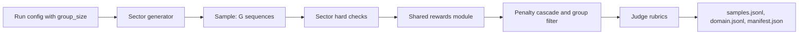

# Next slice: export, groups, and real rewards

Approved direction: depth before breadth. Make generated banking and insurance runs usable as real post-training data before adding more sectors.

Branch off `main` at `8b00aa7`. All six earlier pull requests are merged and their branches are deleted, so there is no stack to sit on and nothing to retarget later.

## Why these three

Against the purpose statement, the platform can now configure, generate, judge, and refine a run. Three things still stop the output from being used for post-training, decision scoring, or evaluation.

### The data cannot leave the platform

`apps/api/app/routes.py` has nineteen endpoints and none of them emits a dataset. A user can compose a study, inspect the journeys, leave notes, and run again, and then has no way to hand the result to a trainer.

### Every group has exactly one member

MiMo is explicit that a Sample spawns a group of Sequences and that the group is accepted or rejected as a whole. Today each journey produces one Sample holding exactly one Sequence, built in `packages/sectors/src/sectors/banking/generate.py`:

```python
return Sample(
    sample_id=ids.take("S"),
    prompt=prompt,
    sequences=[
        Sequence(
            sequence_id=ids.take("Q"),
            contexts=[Context(context_id=ids.take("X"), segments=segments)],
        )
    ],
)
```

With one sequence per prompt there is no group-relative baseline, so `avg@k`, `pass@k`, all-pass and all-fail filtering, and every group-wise reward are unavailable by construction.

### The reward mechanisms are placeholders

The composer offers five reward mechanisms and five signal mechanisms, and the run stores the choice, but the implementation is roughly twenty lines that treat the whole run as a single group:

```python
def _apply_rewards(built: list[_Journey], mechanism: str) -> None:
    if not built:
        return
    successes = [1.0 if item.success else 0.0 for item in built]
    lengths = [max(item.length, 1) for item in built]
    mean_success = sum(successes) / len(successes)
    median = statistics.median(lengths)
```

The same function is duplicated in the insurance pack, so every future sector would copy it again. That is the argument for doing this before telecommunication, airways, and hotels.

## Shape of the work



### Export

A new `apps/api/app/export.py` and `GET /runs/{run_id}/export/{part}` covering three parts, owner-checked the way `require_run` in `apps/api/app/service.py` already does, and returning 409 when the run has no candidate.

- `samples.jsonl` carries one line per Sample: the Sample, Sequence, Context, and Segment hierarchy with `trainable` preserved, plus the new group fields.
- `domain.jsonl` carries one line per domain record across objects, relationships, events, event objects, state transitions, and trajectories.
- `manifest.json` carries the run id, sector, generator id, the run configuration with `credential_id` removed, group size, counts, the judge cycles with their rubric scores and `reference_quality`, the split ratios, and a statement that every record is synthetic. No secret, ciphertext, or fingerprint reaches it.

The train, validation, and test split is assigned deterministically from a hash of `sample_id`, so re-exporting the same run reproduces the same partition. One selected sub-domain can be marked held out, which lets a user measure generalization rather than only fit.

The run page gets a download group. The `api()` helper in `apps/web/lib/api.js` already attaches the bearer token, so the browser fetches each part and saves the blob.

### Groups

`packages/trajectory_contract/src/trajectory_contract/models.py` gains nullable fields only, so bundles already stored in `runs.candidate` keep validating: `group_accepted` and `group_pass_rate` on Sample; `outcome`, `solution_score`, `behavior_score`, `quality_factor`, `token_estimate`, and `dropped` on Sequence; `dropped` on Context; and `flagged_reason` on Segment.

`RunBody` and `RerunBody` gain `group_size`, defaulting to 1 and capped at 16 so the studio cap of sixty-four primary trajectories stays a bounded amount of work. Each generator draws G variants of one prompt from the seeded RNG it already uses, varying dwell time and branch choice, so a group holds genuinely different outcomes for the same request and stays reproducible from the seed.

### Rewards

One new `packages/sectors/src/sectors/rewards.py`, shared by both packs and inherited by every future sector, holding the MiMo mechanisms rather than approximations of them.

- Multiplicative reward, the product of the verifiable outcome, the solution rubric score, and the behavior rubric score. A hard-check failure forces the outcome term to zero, so a failing journey can never be rescued by rubric scores.
- Group-relative advantage, each sequence reward minus the group mean.
- Groupwise advantage redistribution over the passing set, computed so that total positive advantage mass is conserved while it shifts from lower-quality to higher-quality successful sequences, with the common rescaling factor capped and failing sequences left untouched.
- A group-relative length penalty gated on pass rate and measured against a percentile reference length, applied only to successful sequences, so difficult prompts keep room to explore.
- A segment penalty that masks flagged segments in positive sequences and weights them more heavily in negative ones, conserving each sign's mass.
- The cascade: a context with no surviving trainable segment is dropped, a sequence with no surviving context receives zero advantage, and a sample with no surviving sequence is rejected. All-pass and all-fail groups are marked as not accepted, matching the dynamic sampler behaviour in the paper.

Tests assert each formula against hand-computed values, along with advantage mass conservation, the pass-rate gate exempting hard groups, and the cascade. They follow the style already in `tests/test_generator.py`.

## Task list

1. Add `apps/api/app/export.py` and the export route for the three parts, owner-only, 409 when there is no candidate.
2. Add the deterministic split and the held-out sub-domain marker, recorded in the manifest.
3. Add the download group to the run page.
4. Test export shape, split determinism, owner isolation, and that no key, ciphertext, or fingerprint reaches the manifest.
5. Widen the training layer with the nullable group and scoring fields.
6. Add `group_size` to `RunBody` and `RerunBody` and have both generators emit G sequences per sample.
7. Create the shared rewards module and delete both copies of `_apply_rewards`.
8. Implement the penalty cascade and group filtering.
9. Test each formula, mass conservation, the pass-rate gate, and the cascade.
10. Update `docs/trajectory-contract.md` and `docs/evaluation.md` with the group semantics, the reward formulas, and the export contract.

## Explicitly out of scope here

Telecommunication, airways, and hotels wait until the reward layer is shared. Tool-use segments and deeper corpus ingestion are the next two candidates after this slice. The full backlog is in [overview.md](overview.md).

## On the MiMo PDF

The uploaded copy carries no annotation layer. It holds 320 link annotations from the paper's own cross-references and zero highlights or notes, and its metadata names `pdf-lib` as both creator and producer with a single rewrite pass, which is what a copy pipeline that drops the markup layer looks like.

This plan therefore draws on the paper's own content: the Sample, Sequence, Context, Segment hierarchy, the multiplicative rubric reward, groupwise advantage redistribution, and the two penalty mechanisms. If your highlights marked different priorities, a re-export from the annotating tool, or a comment sidecar, would change what gets built first. The PDF itself stays out of the repository.
