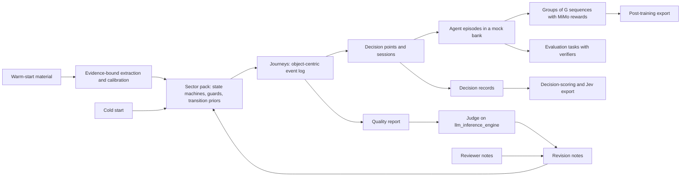

# Domain trajectory studio: roadmap overview

Repository: https://github.com/caglarsubas/domain-trajectory-data-generation

Last reviewed: 25 September 2026, against `main` at `3c46d4c`. This revision re-read the purpose statement, the MiMo-V2.6 report, and both research reports in `docs/banking`, audited the code on `main` by running the generators, and checked how the judge reaches `llm_inference_engine` and what a Jev-type model consumes. The audit changed the order of work. The evidence is in [next-slice.md](next-slice.md#why-the-order-changed). Six open decisions were settled the same day, all as recommended; they are listed under [Decisions](#decisions).

Companion files: [delivered.md](delivered.md) records what each merged slice established. [next-slice.md](next-slice.md) is the approved plan for the work now in front of us.

## Purpose

A platform where users generate comprehensive, complete, qualitative, representative domain-specific trajectory data for post-training, decision scoring, and evaluation of LLMs and Jev-type models.

Users upload warm-start material: deep-search reports, papers, GitHub repositories, and data sources. The platform recommends a warm start and says plainly that it gives better results, while still allowing a cold start. Users configure each run by expected data size, trajectory length, sub-domain scope, language, and reward and signal mechanisms. The admin account holds the platform's provider keys. User and demo accounts bring their own keys for OpenAI, Anthropic, Google, xAI, and similar providers, and those keys run the deep search on the provider's side. Banking comes first, then insurance, telecommunication, airways, and hotels. The platform judges its own output through `llm_inference_engine`. The studio is visually rich, and the loop of configuring a run, inspecting it, leaving feedback, and running again is easy to follow.

## What done means

| Purpose clause | What satisfies it | On `main` today | Closed by |
|---|---|---|---|
| Complete | Every journey legal end to end: zero impossible transitions, referential integrity, a terminal or horizon state | Two banking lifecycle rules are checked. A journey holding both `kyc.passed` and `kyc.failed` passes. | Slice 1 |
| Comprehensive | Coverage of the selected sub-domains, event types, variants, and rare paths | 64 journeys over all seven banking sub-domains hold 8 distinct event sequences | Slice 1 |
| Representative | Transition and dwell-time distributions calibrated from warm-start material, with conformance measured against it | Warm start contributes substring matches from a 2,000-character excerpt | Slices 4 and 5 |
| Qualitative | Judge scores that can be trusted, and natural text in the chosen language | One trajectory is judged once, by the engine's default 3B model. Every language except Turkish is written in English. | Slices 1, 4, and 6 |
| Post-training | Groups of sequences per prompt, MiMo rewards, tool-using agent episodes, export | One sequence per sample, placeholder rewards, narrated prose, no export | Slices 2 and 6 |
| Decision scoring | Decision records at branch points: state, options, outcome, score | `decision_score` changes only prompt text | Slice 6 |
| Evaluation | Tasks with verifiers, held-out splits, avg@k and pass@k | No evaluation export | Slices 2 and 6 |
| Jev-type models | Typed decision records (choice, score, true or false) with calibrated targets | `target_family="jev"` changes only prompt text | Slice 6 |
| Warm-start material | PDFs, repositories, links, and data sources actually read, with an extraction report | PDFs are dropped or read as raw bytes. Links and repositories are never fetched. | Slice 5 |
| Warm versus cold guidance | Recommend warm, warn when warm material yields nothing usable, allow cold with acknowledgment | The wording and the acknowledgment exist. Nothing warns when a document yields no text. | Slices 1 and 5 |
| Run configuration | Size, length, scope, language, reward, and signal each change the data | Size stops at 64 without the composer saying so. Length is met by repeating events. Signal changes only text. | Slices 1, 2, 3, and 6 |
| Admin keys and BYOK | Custody, deletion and rotation, live validation, demo quotas | Custody and the four deep-search request shapes exist. Keys cannot be deleted or rotated, validation checks only the prefix, and demo accounts have no limits. | Slices 0 and 3 |
| Own evaluation cycle | Judge calls that succeed, repeat, agree, and drive regeneration | The configured engine address cannot be reached. A second cycle re-judges the same candidate. | Slices 0 and 4 |
| Visually rich studio | Time axis, process map, variant explorer, sample and group viewer, re-run diff | A grid of events by index and four score meters. No charts, no diff. | UX track, every slice |
| Sectors | Banking first, then the others on one schema | Banking and insurance share the run schema | Slice 7 |

## How the pieces fit

Journeys and training trajectories are different things, and the platform needs both. A journey is a customer's path through the bank over days or months, stored as an object-centric event log. A training trajectory is what a model does inside one moment of that journey: the prompt, its turns, its tool calls, and the result. The journey supplies the state and the decision points. Each decision point then yields the outputs the purpose asks for.

This follows the MiMo-V2.6 report and both research reports:

- The domain layer stays object-centric, as OCEL 2.0 describes. One event links many objects with qualified roles, and objects carry attributes that change over time.
- A pack is a set of orthogonal state machines, such as relationship, KYC, application, account, card, and credit. Hard rules make impossible states unreachable. A semi-Markov sampler chooses among the legal next events and samples how long each step takes. This is the hybrid constrained generator the GPT report recommends as the first production design.
- A decision point is an MDP state, as in the Gemini report. The state is a snapshot of the objects, the actions are bank operations named after BIAN service domains, and each option has a simulated outcome.
- An agent episode is a MiMo Sample. It spawns a group of Sequences, and the group is accepted or rejected as a whole. Tools act on the mock bank's state, and the task is verified with atomic rubric items: code checks for deterministic facts and judge checks for open-ended text, as in MiMo §4.2.2.
- A decision record is what a Jev-type model consumes: a curated state with derived facts precomputed, a typed question with explicit criteria, and a target distribution for calibration.

## The four quality words as measurements

Every run gets a quality report, stored with the run and shown on its page. A run is released for export only when it passes the first gate. The order follows the GPT report's validation hierarchy: invariants first, then process, then statistics.

- **Complete.** Zero hard-check violations, full referential integrity, the share of journeys that reach a terminal or horizon state, and no filler repetition.
- **Comprehensive.** Distinct variants per hundred journeys, event-type coverage for each selected sub-domain, the share of rare but valid paths, and n-gram coverage of transitions.
- **Representative.** When a data source is present, distances between generated and reference distributions: Jensen–Shannon for event types and variants, Kolmogorov–Smirnov or Wasserstein for dwell times. Process conformance adds fitness and precision against a directly-follows model of the reference, computed in-house, following the conformance measures in the Gemini report. A cold start is marked unreferenced, never scored as representative.
- **Qualitative.** Judge rubric scores with their agreement across repeats and across two judge models, plus text checks: the right language, whole sentences, and no leaked reviewer text.

## Standing constraints

These hold across every slice and should not be renegotiated silently.

- Sector order is banking, then insurance, then telecommunication, airways, and hotels. Adding a sector widens the `sector` literal and registers a pack. It does not change the run schema.
- The judge is the platform tenant on `llm_inference_engine`, tenant `domain-trajectory-data-generation`, organization `org-trajdata`. Local hard checks run first, and a failed check must not call the model. A cold start is marked `reference_quality=weak`.
- The admin account may store platform provider keys. User and demo accounts must bring their own key. Credentials are encrypted with `CREDENTIAL_MASTER_KEY` and are returned only as provider, label, and fingerprint.
- Secrets stay out of git, logs, and API responses. A key that ever reached git history is treated as compromised and rotated. Provider keys and `INFERENCE_ENGINE_API_KEY` are never returned or logged, and tests mock HTTP rather than printing keys.
- A cold start requires `cold_start_acknowledged`. A warm start requires at least one corpus item, and the composer warns when the warm material yields no readable text.
- The composer never changes a request silently. Caps and substitutions are shown before generation, not only after it.
- Structure comes from the pack, never from a provider. The pack's state machines fix which events happen and in what order. On top of that skeleton, a provider may write the text of turns and act as the agent in an episode, using only the key of the account that owns the run. Every provider turn is checked against the skeleton by code before it is kept, and the judge stays on `llm_inference_engine`.
- Invariants come first. A run with an impossible transition is never exported, whatever its judge scores.
- Facts extracted from warm-start material carry their source, the evidence span, and a confidence. Only facts the source states explicitly enter hard rules automatically. Strongly implied facts need the user's approval in the studio.
- An alternative branch is a simulated alternative, not a causal counterfactual. A decision-level counterfactual pair, which decision-scoring and Jev-type data need, is allowed only relative to the generator's own decision rule and is labeled `counterfactual_basis: generator_policy`.
- Synthetic does not mean anonymous. Uploaded material is scrubbed before it is stored, and exported data is checked for verbatim copies of uploaded records.
- Reviewer text never becomes trainable text. Only assistant segments are trainable.
- Every run records the generator and pack versions, the seed, and the corpus hashes it used, so it can be reproduced.
- Jev-type is a target family on the same contract, not a trainer.
- The MiMo paper PDF is not committed.

## Position today

The loop of configuring, generating, judging, leaving feedback, and re-running works end to end, and 34 tests cover it. The data it produces is not yet usable for any of the three stated uses. In short:

- Journeys come from eight fixed variants in rotation, are stretched to length by repeating events, and can contradict themselves when warm-start text names both outcomes of a decision.
- The training layer is canned prose with one prompt per run. It has no link back to the journey it narrates, and reviewer comments end up in trainable text.
- The judge cannot be reached with the configured address. When it can, the engine's default 3B model judges one trajectory once.
- Warm-start documents contribute at most 2,000 characters of text, matched by substring. PDFs, repositories, and links contribute nothing usable.
- Size, signal, consumer, and target family either stop at a cap or change only prompt text.
- The studio shows events on a grid by index, with four score meters. Files added during a re-run are dropped.

## Roadmap

Depth before breadth, and truth before volume. No new sector until the registered ones produce data a trainer or an evaluator would accept. This order was approved on 25 September 2026.

| Slice | Goal | Exit criterion |
|---|---|---|
| 0. Rotate credentials and fix the judge wiring | A fresh engine credential and judge calls that succeed | A live evaluation succeeds from the Compose stack with the new key |
| 1. Trustworthy journeys | Legal, diverse journeys in both registered packs, and a quality report that shows it | Zero violations across a property-based sweep, and at least 32 distinct sequences in 64 journeys over all seven banking sub-domains, against 8 today |
| 2. Groups, shared rewards, export | The design approved earlier, revised: G sequences per prompt, MiMo rewards in one shared module, four export parts | Formulas match hand-computed values, and a re-export reproduces the same split |
| 3. Background jobs and honest scale | Generation, judging, and deep search run as jobs with progress, and the size a user asks for is met or refused | A 10,000-journey run completes as a job with progress and can be cancelled |
| 4. A judge you can trust | Repeated and cross-model judgments, synthesized rubrics, cycles that regenerate | Agreement is reported per rubric, and disagreements are flagged in the studio |
| 5. Deep warm start | Documents, repositories, links, and data sources are read, extracted with evidence, and used to calibrate the sampler | A BPI Challenge 2017 upload calibrates the consumer-credit sub-domain, and the conformance scores show it |
| 6. Episodes, decision records, evaluation tasks | Tool-using agent episodes, Jev decision records, and evaluation tasks from the same journeys, with real signal mechanisms | Each consumer gets its own export, and every decision record validates against the platform's decision-record schema |
| 7. More sectors | Telecommunication, airways, and hotels on the shared framework | Each new pack passes the same quality gates as banking |

### Slice 0. Rotate credentials and fix the judge wiring

Small and urgent. Issue a fresh engine key and address. Make the judge client normalize the base address, send `judge_model` explicitly, wait longer than the engine's own completion timeout, retry once where `Retry-After` allows, and report engine failures as 502, 503, or 504 instead of 500. Fix the Compose default for the key id, refuse the default JWT secret outside development, and add deletion and rotation for stored keys. Detail in [next-slice.md](next-slice.md#slice-0-rotate-credentials-and-fix-the-judge-wiring).

### Slice 1. Trustworthy journeys

The approved next slice. A shared lifecycle engine replaces the variant templates in both packs: orthogonal state machines, guards and exclusive outcomes, a semi-Markov sampler with dwell-time distributions, and length met by sampling rather than repetition. Hard checks are derived from the same state machines, so every rule the sampler obeys is verified again on the output. Warm-start text weights the sampler's choices instead of forcing events in. The training layer links each sample to its journey and keeps reviewer text out of trainable segments. Quality report v1 measures complete and comprehensive. The run page gains a time axis, a process map, and a variant explorer. Detail in [next-slice.md](next-slice.md#slice-1-trustworthy-journeys).

### Slice 2. Groups, shared rewards, export

The slice approved earlier, kept and revised: `group_size` up to 16 per prompt, the nullable group and scoring fields, and one shared `rewards.py` with MiMo's multiplicative reward, group-relative advantage, groupwise advantage redistribution, the gated length penalty, segment penalties, and the penalty cascade. Export gains an OCEL 2.0 JSON part, so process-mining tools can read the domain layer, and a data card in the manifest. Detail in [next-slice.md](next-slice.md#queued-slice-2-groups-shared-rewards-and-export).

### Slice 3. Background jobs and honest scale

The first work that needs more time than an HTTP request allows is the judge in Slice 4, so jobs land first. Generation, judging, and deep search run as jobs with progress, cancellation, and resumption. The cap of sixty-four goes. Bundles are stored outside the list query, so opening the studio no longer downloads every run. Expected data size becomes a target number of accepted samples: the job oversamples by the observed acceptance rate, in the spirit of MiMo's Sample Mixer, and can hold a share per sub-domain. Demo accounts get quotas, and a stored key is validated with a real call when it is saved.

Progress, 26 September 2026: Slice 3 ships in four pull requests. The first puts generation behind a job queue on the application database: a `jobs` table, a worker that runs as its own Compose service, a background thread, or inline on SQLite, progress reports, cancellation before and during a run, requeueing of jobs whose worker stopped, and a run list that no longer loads any bundle. On Postgres, four concurrent workers ran 40 jobs with each run exactly once. The second removes the cap: batched, resumable generation into compressed files, journeys served a page at a time, and an overview built batch by batch; a 10,000-journey run completes as a job in about 22 seconds with no rule violations. The third exports large runs as a job, streamed batch by batch into gzipped parts with a manifest whose checksums match, and sizes a run by a target number of accepted groups, oversampling from the observed acceptance rate up to a ceiling of five times the target, with an optional share per sub-domain. It showed that rollouts in five of the seven banking sub-domains never fail, so their groups carry no group signal; the ceiling reports it, and making those failures reachable is follow-up work. The fourth, completing the slice, moves judging and deep search into jobs with progress and cancellation, checks every saved key with a free authenticated call to its provider, and gives demo accounts daily limits on runs, judge cycles, and deep searches and a limit on run size. It also caps oversampling at the run limit and keeps a judged run's journeys visible.

### Slice 4. A judge you can trust

The judge sees what it is judging: amounts, states, and the sample text, within the 32k window the engine really serves. It judges a stratified sample of each run, not only the first journey. Each rubric is judged several times and by two models, `qwen3.8:27b` as the primary judge and `gemma4:26b` as the second opinion, and pairwise comparisons run in both orders. The studio shows agreement and flags likely false positives and false negatives, as MiMo §4.2.1 does with rollout auditing. Following MiMo's groupwise reward synthesis, the judge studies a group of journeys together with the warm-start material and proposes study-specific solution and behavior rubrics, which the user reviews before they are used. An evaluation cycle regenerates from its revision notes instead of re-judging the same candidate, and `accepted` gates export. Several items depend on engine changes, listed under cross-repository dependencies.

Progress, 26 September 2026: Slice 4 ships in three pull requests. The first changes what the judge sees and whom it asks, which needs no engine change: each cycle judges a stratified sample of six journeys, rendered with their objects, amounts, state changes, and sample text inside an 8,000-token budget; asks `qwen3.8:27b` and `gemma4:26b` every rubric and pairwise quality in both orders; adds a control journey whose events are out of order; and records agreement, order consistency, and audit flags for likely false positives and false negatives, shown in a judge panel. Repeated judging by one model waits on the engine, which judges at temperature 0. The second, study-specific rubrics proposed from a group of journeys and reviewed by the user, waits on the engine's rubric registry, so the third came first: a run the judge has read is not judged again but regenerated from its revision notes and notes and judged as soon as it is ready, within `max_cycles` rounds; each run records what every note did; the run page shows what changed from the previous run; and export needs an accepted cycle unless it is asked for without one, which the manifest records. The diff showed that the helpfulness revision, which raises the minimum length, also dropped journeys the domain ends early: a banking run over onboarding, deposits, and consumer credit went from 16.7 declined applications and failed KYC checks per 100 journeys to none. The raised minimum now applies only to journeys that can go on, and a journey the domain ends is held to the requested minimum instead.

### Slice 5. Deep warm start

Documents are parsed: PDF, DOCX, HTML, and Markdown. Repositories are fetched for their README, documentation, and machine-readable API definitions such as OpenAPI and AsyncAPI, which the GPT report ranks as the most authoritative source. Links are fetched with a guard against internal addresses. Data sources in CSV, Parquet, XES, or OCEL 2.0 calibrate the sampler's transition probabilities and dwell times per sub-domain. A catalogue of public banking sources ships with BPI Challenge 2017, UCI Bank Marketing, and the CFPB complaint database. HMDA and the Freddie Mac loan-level data follow once their terms are reviewed, and AMLSim and PaySim cover transaction patterns. Catalogue sources are downloaded on demand into the upload store rather than committed, and each records its licence and snapshot date. Extraction returns facts with evidence and confidence, sorted into explicit, strongly implied, and not supported, and the studio has a review queue for the middle group. Retrieval replaces the 2,000-character excerpt. Each study chooses a jurisdiction profile, neutral retail by default or Turkey or the United Kingdom, which sets currency, product taxonomy, KYC rules, and language.

### Slice 6. Episodes, decision records, evaluation tasks

The three consumers stop sharing one output.

- **Post-training.** At each decision point or session, an episode builder assembles a mock bank: the state snapshot, a tool API named after BIAN operations and shaped by any OpenAPI definitions from Slice 5, a task, and atomic rubric items. Rollouts come from a scripted policy with perturbations and from provider models acting through the key of the account that owns the run, so a group can mix models and outcomes. Every provider turn is checked against the skeleton, and the composer shows the expected number of provider calls and a budget cap before the run starts. Tool segments appear, and each episode can be exported in more than one harness format, with one held out to measure generalization, as in MiMo's multi-harness training.
- **Decision scoring and Jev.** Decision records carry a curated state with derived facts precomputed, because Jev-type models do not do arithmetic or date reasoning. They also carry a typed question (choice, score, or true or false) with explicit criteria and an abstain option, a target distribution from the generator's policy, the simulated outcome, invariance variants such as reordered keys and paraphrases, and separate train, calibration, and held-out splits. They export as JSONL in the platform's own decision-record schema, versioned with the contract. Every assistant decision point also yields a history-prefix record, as in MiMo's prefix-conditioned distillation.
- **Evaluation.** Tasks export with their environment, verifiers, and reference trajectories, and results are reported as avg@k and pass@k.

The five signal mechanisms each map to a scorer, and `consumer` and `target_family` choose export parts and composer presets instead of changing prompt text.

### Slice 7. More sectors

Telecommunication, airways, and hotels, each a pack of state machines and priors on the shared lifecycle engine, rewards, quality report, calibration, and episode builder. Each pack must pass the same gates as banking before the composer offers it.

## UX track

Every slice ships the view that makes its change visible. Views are drawn in plain SVG on the existing design tokens; the process map, time axis, and variant explorer from Slice 1 needed nothing more. A charting library comes in only when a view needs distributions, such as the calibration comparisons in Slice 5.

| Slice | What the studio gains |
|---|---|
| 0 | Engine errors shown in words with the request id, and key deletion and rotation in Settings |
| 1 | Time-axis swimlanes per object, a process map with transition counts, a variant explorer, and the quality scorecard. The composer shows the cap and gates Generate on the acknowledgment. Files added during a re-run are kept, a study is reused across runs, and trajectory-level feedback gets a place. |
| 2 | A group viewer with G sequences side by side, reward and advantage per sequence, and a download panel with the data card |
| 3 | Job progress and cancellation, and a run list that loads fast |
| 4 | A judge panel with justifications and agreement, rubric review, and a re-run diff showing what changed and which notes were applied |
| 5 | Warm-start strength per document, an extraction report, the fact review queue, and jurisdiction choice |
| 6 | An episode viewer with tool calls, a decision explorer with options and probabilities, consumer presets in the composer, and a provider-call estimate with a budget cap |

## Cross-repository dependencies

In `llm_inference_engine`, needed by Slices 0 and 4:

- `/v1/evals/run` bypasses the tenant scheduler, so judge load queues inside Ollama where the engine cannot see it. Evals should take a scheduler slot as chat does.
- The safety rubric's template leaves out the prompt, so the trajectory app's safety instruction never reaches the judge.
- Custom rubrics can be registered only in-process. `process_conformance`, `decision_score`, and study-specific rubrics need a file-based or API registry.
- The judge runs at temperature 0 with one call per request. Agreement needs repeats at a temperature above 0, and pairwise needs an A/B swap.
- A timeout or an over-long prompt on the eval route comes back as a generic 500. Both should map to typed errors.
- `/v1/models` reports each model's trained window, but Ollama serves 32,768 tokens. The judge's prompt budget must assume 32k.
- Verdicts come back empty for longer prompts. On 25 September a live run through the studio got an empty verdict for helpfulness, correctness, and pairwise quality from `qwen3.8:27b`, and a short check got one from `gemma4:26b`. The engine pins judge output at 512 tokens, which a reasoning model can spend before it writes the verdict. The judge needs a larger output budget, or reasoning turned off, for eval calls. Until then the studio leaves such rubrics unscored instead of scoring them 0.
- The default judge model is `llama3.2:3b`. The trajectory app will name its judges explicitly: `qwen3.8:27b` as the primary and `gemma4:26b` as the second opinion, both already loaded.
## Decisions

Settled on 25 September 2026, all as recommended in the review.

1. **Providers write text and act as agents on a fixed skeleton.** A provider may write the text of turns and act as the agent in an episode, on top of a skeleton the pack has fixed, using only the key of the account that owns the run. Every provider turn is checked against the skeleton by code, and the judge stays on the engine. Provider-written turns arrive with the episode builder in Slice 6. Slice 1 stays template-based and makes no provider calls, so it costs nothing to run.
2. **English and Turkish.** Both packs declare these two languages. Any other code is refused with a message instead of silently producing English.
3. **Three jurisdiction profiles.** Neutral retail, the default, plus Turkey and the United Kingdom, which the research reports and the current currency defaults already lean on. They arrive in Slice 5. Until then, currency follows the language as it does today.
4. **Calibration sources.** BPI Challenge 2017, UCI Bank Marketing (CC BY 4.0), and the CFPB complaint database ship first. HMDA and the Freddie Mac loan-level data follow once their terms are reviewed. AMLSim and PaySim cover transaction patterns.
5. **Judge models.** `qwen3.8:27b` is the primary judge from Slice 0, and `gemma4:26b` joins as the second opinion for agreement in Slice 4.
6. **No PM4Py dependency.** PM4Py is copyleft, so the scorecard computes fitness and precision against a directly-follows model in-house. The OCEL export stays readable by PM4Py for anyone who wants the full toolkit.

## Stack

FastAPI, SQLAlchemy, and Alembic over Postgres with a SQLite fallback, Pydantic for the contract, and a Next.js App Router studio. Docker Compose runs Postgres, the API, and the studio together. The studio is published on host port 3000 and the API on host port 18000, which `API_HOST_PORT` overrides. Planned additions: a job queue in Slice 3, `pypdf` for PDFs in Slice 5 (PyMuPDF is AGPL), and a charting library only when a view needs distributions. Conformance is computed in-house rather than through PM4Py.
