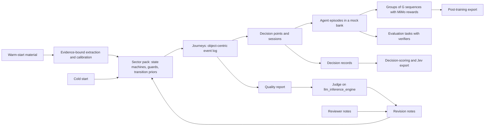

# Domain trajectory studio: roadmap overview

Repository: https://github.com/caglarsubas/domain-trajectory-data-generation

Last reviewed: 26 September 2026, against `main` at `234ba5b`, after Slices 0 to 7 shipped. This review:
- re-ran the gates for all five packs
- measured group signal in every sub-domain of every pack
- estimated generation cost with episodes, decision records, and the decision-score signal
- checked each open item in `llm_inference_engine` at `5e91407`
- re-read the standing constraints against the code

The previous review, against `3c46d4c` on 25 September, set the slice order that has now been delivered; its evidence is in git history. What this review found, and the slices it set, are in [next-slice.md](next-slice.md); they and decisions 7 to 12 were approved the same day, all as recommended.

Companion files: [delivered.md](delivered.md) records what each merged pull request established. [next-slice.md](next-slice.md) is the approved plan for the work now in front of us.

## Purpose

A platform where users generate comprehensive, complete, qualitative, representative domain-specific trajectory data for post-training, decision scoring, and evaluation of LLMs and Jev-type models.

Users upload warm-start material: deep-search reports, papers, GitHub repositories, and data sources. The platform recommends a warm start and says plainly that it gives better results, while still allowing a cold start. Users configure each run by expected data size, trajectory length, sub-domain scope, language, and reward and signal mechanisms. The admin account holds the platform's provider keys. User and demo accounts bring their own keys for OpenAI, Anthropic, Google, xAI, and similar providers, and those keys run the deep search on the provider's side. Banking comes first, then insurance, telecommunication, airways, and hotels. The platform judges its own output through `llm_inference_engine`. The studio is visually rich, and the loop of configuring a run, inspecting it, leaving feedback, and running again is easy to follow.

## What done means

| Purpose clause | What satisfies it | On `main` today | Status |
|---|---|---|---|
| Complete | Every journey legal end to end: zero impossible transitions, referential integrity, a terminal or horizon state | Every pack's journeys replay through its own machines. The gates' sweep of 150 random configurations per pack breaks no rule, and every event of every pack is reachable. | Met |
| Comprehensive | Coverage of the selected sub-domains, event types, variants, and rare paths | 41 to 57 distinct sequences in 64 journeys across the five packs, and every sub-domain reaches its milestones alone and together | Met |
| Representative | Transition and dwell-time distributions calibrated from warm-start material, with conformance measured against it | Event logs in CSV, Parquet, XES, or OCEL 2.0 calibrate any pack. Fitness, precision, and next-step divergence are reported. The catalogue offers banking sources only. | Partly; Slice 10 |
| Qualitative | Judge scores that can be trusted, and natural text in the chosen language | Two judges, pairwise in both orders, a control journey, audit flags, and regeneration from notes. Repeats above temperature 0, study-specific rubrics, and the safety prompt wait on the engine. Turn text is templated narration in English or Turkish. | Partly; Slices 9 and 10 |
| Post-training | Groups of sequences per prompt, MiMo rewards, tool-using agent episodes, export | Groups of up to 16, the shared MiMo rewards with every signal scored, episodes in three harness formats with provider rollouts, and history prefixes. Some sub-domains never yield an accepted group, and narrow scopes draw almost only failures. | Partly; Slice 8 |
| Decision scoring | Decision records at branch points: state, options, outcome, score | Decision points with policy shares and simulated values, exported as typed questions under a versioned schema every record validates against | Met |
| Evaluation | Tasks with verifiers, held-out splits, avg@k and pass@k | Journey and agent tasks with environment, verifiers, and references, reported as avg@k and pass@k by verifier and by policy, including each provider model | Met |
| Jev-type models | Typed decision records (choice, score, true or false) with calibrated targets | Derived facts precomputed, explicit criteria, an abstain answer, policy-share and simulated-value targets, invariance variants, and train, calibration, and held-out splits | Met |
| Warm-start material | PDFs, repositories, links, and data sources actually read, with an extraction report | PDF, Word, HTML, Markdown, and OpenAPI or AsyncAPI definitions; links behind an address guard; GitHub repositories; event logs; facts with evidence and review | Met |
| Warm versus cold guidance | Recommend warm, warn when warm material yields nothing usable, allow cold with acknowledgment | The composer recommends warm, warns when no document is readable, and needs an acknowledgment for cold | Met |
| Run configuration | Size, length, scope, language, reward, and signal each change the data | Size to 100,000 sequences as jobs, length, scope, language, reward, signal, consumer, and target family all change the data. A minimum length beyond a narrow scope's natural length silently favours failures. | Partly; Slice 8 |
| Admin keys and BYOK | Custody, deletion and rotation, live validation, demo quotas | Custody, deletion, rotation, a live check on save, demo quotas, and a provider-call cap | Met |
| Own evaluation cycle | Judge calls that succeed, repeat, agree, and drive regeneration | Calls succeed, two models agree or disagree per rubric, and cycles regenerate from notes. Repeats wait on the engine. | Partly; Slice 9 |
| Visually rich studio | Time axis, process map, variant explorer, sample and group viewer, re-run diff | All of these, plus the judge panel, episode and decision viewers, the signal table, and the export panel with each consumer's parts | Met |
| Sectors | Banking first, then the others on one schema | Banking, insurance, telecommunications, airline, and hotel, each past the same gates | Met |
| Synthetic, not copied | Uploads scrubbed before storage, exports checked for verbatim copies of uploaded records | Uploads are scrubbed. Exports are not checked for copies. | Partly; Slice 8 |

## How the pieces fit

Journeys and training trajectories are different things, and the platform needs both. A journey is a customer's path through the bank over days or months, stored as an object-centric event log. A training trajectory is what a model does inside one moment of that journey: the prompt, its turns, its tool calls, and the result. The journey supplies the state and the decision points. Each decision point then yields the outputs the purpose asks for.

This follows the MiMo-V2.6 report and both research reports:

- The domain layer stays object-centric, as OCEL 2.0 describes. One event links many objects with qualified roles, and objects carry attributes that change over time.
- A pack is a set of orthogonal state machines, such as relationship, KYC, application, account, card, and credit. Hard rules make impossible states unreachable. A semi-Markov sampler chooses among the legal next events and samples how long each step takes. This is the hybrid constrained generator the GPT report recommends as the first production design.
- A decision point is an MDP state, as in the Gemini report. The state is a snapshot of the objects, the actions are bank operations named after BIAN service domains, and each option has a simulated outcome.
- An agent episode is a MiMo Sample. It spawns a group of Sequences, and the group is accepted or rejected as a whole. Tools act on the mock bank's state, and the task is verified with atomic rubric items: code checks for deterministic facts and judge checks for open-ended text, as in MiMo §4.2.2.
- A decision record is what a Jev-type model consumes: a curated state with derived facts precomputed, a typed question with explicit criteria, and a target distribution for calibration.

## The four quality words as measurements

Every run gets a quality report, stored with the run and shown on its page. A run is released for export only when it passes the first gate. The order follows the GPT report's validation hierarchy: invariants first, then process, then statistics.

- **Complete.** Zero hard-check violations, full referential integrity, the share of journeys that reach a terminal or horizon state, and no filler repetition.
- **Comprehensive.** Distinct variants per hundred journeys, event-type coverage for each selected sub-domain, the share of rare but valid paths, and n-gram coverage of transitions.
- **Representative.** When a data source is present, distances between generated and reference distributions: Jensen–Shannon for event types and variants, Kolmogorov–Smirnov or Wasserstein for dwell times. Process conformance adds fitness and precision against a directly-follows model of the reference, computed in-house, following the conformance measures in the Gemini report. A cold start is marked unreferenced, never scored as representative.
- **Qualitative.** Judge rubric scores with their agreement across repeats and across two judge models, plus text checks: the right language, whole sentences, and no leaked reviewer text.

## Standing constraints

These hold across every slice and should not be renegotiated silently.

- Sector order was banking, then insurance, then telecommunication, airways, and hotels; all five are registered. A new sector registers a pack that passes the gates in `sectors.gates`. It does not change the run schema.
- The judge is the platform tenant on `llm_inference_engine`, tenant `domain-trajectory-data-generation`, organization `org-trajdata`. Local hard checks run first, and a failed check must not call the model. A cold start is marked `reference_quality=weak`.
- The admin account may store platform provider keys. User and demo accounts must bring their own key. Credentials are encrypted with `CREDENTIAL_MASTER_KEY` and are returned only as provider, label, and fingerprint.
- Secrets stay out of git, logs, and API responses. A key that ever reached git history is treated as compromised and rotated. Provider keys and `INFERENCE_ENGINE_API_KEY` are never returned or logged, and tests mock HTTP rather than printing keys.
- A cold start requires `cold_start_acknowledged`. A warm start requires at least one corpus item, and the composer warns when the warm material yields no readable text.
- The composer never changes a request silently. Caps and substitutions are shown before generation, not only after it.
- Structure comes from the pack, never from a provider. The pack's state machines fix which events happen and in what order. On top of that skeleton, a provider may write the text of turns and act as the agent in an episode, using only the key of the account that owns the run. Every provider turn is checked against the skeleton by code before it is kept, and the judge stays on `llm_inference_engine`.
- Invariants come first. A run with an impossible transition is never exported, whatever its judge scores.
- Facts extracted from warm-start material carry their source, the evidence span, and a confidence. Only facts the source states explicitly enter hard rules automatically. Strongly implied facts need the user's approval in the studio.
- An alternative branch is a simulated alternative, not a causal counterfactual. A decision-level counterfactual pair, which decision-scoring and Jev-type data need, is allowed only relative to the generator's own decision rule and is labeled `counterfactual_basis: generator_policy`.
- Synthetic does not mean anonymous. Uploaded material is scrubbed before it is stored, and exported data is checked for verbatim copies of uploaded records. The export check is not built yet; it is part of Slice 8.
- Reviewer text never becomes trainable text. Only assistant segments are trainable.
- Every run records the generator and pack versions, the seed, and the corpus hashes it used, so it can be reproduced.
- Jev-type is a target family on the same contract, not a trainer.
- The MiMo paper PDF is not committed.

## Position today

All eight slices have shipped, 272 tests cover them, and the data serves all three stated uses. The gaps below were each reproduced against `234ba5b`:

- **Narrow scopes favour failures.** A journey that runs out of legal events in its scope before the minimum length is redrawn, so only journeys that end early on a failure qualify. With a minimum of six events, airline booking alone passed none of 400 sequences, and hotel booking alone passed 2%.
- **Some sub-domains carry no group signal.** With groups of four, no group is accepted in insurance quoting, billing, servicing, and complaints, telecom fault management, or airline loyalty, because no rollout there can fail. Hotel check-out and airline baggage accept fewer than one group in ten. Their advantages are all zero.
- **Exports are not checked for copies of uploaded records**, although the standing constraints require it.
- **There is no CI.** Pull requests have merged with no checks; the suite runs only where someone runs it.
- **Cost at scale.** For banking with groups of four, episodes, decision records, and the decision-score signal raise the estimated time to generate 10,000 sequences from about 7 seconds to about 49. This is not yet measured end to end.
- **The judge.** Engine #115 stopped the empty verdicts. Other engine items are still open, so study-specific rubrics (4B) and repeated judging still wait:
  - evals bypass the engine's scheduler
  - the safety rubric omits the prompt
  - rubrics register only in-process
  - judging runs once at temperature 0
  - eval errors are untyped
- **Representative beyond banking** depends on logs a user uploads; the catalogue has no telecom, airline, hotel, or insurance source.
- **Text is templated narration** in English and Turkish. Provider-written turn text, which the first decision allows, is not built.

## Roadmap

Depth before breadth, and truth before volume. This order was approved on 25 September 2026, and every slice in it has shipped; [delivered.md](delivered.md) lists the pull requests. The slices approved after it follow the table.

| Slice | Goal | Exit criterion |
|---|---|---|
| 0. Rotate credentials and fix the judge wiring | A fresh engine credential and judge calls that succeed | A live evaluation succeeds from the Compose stack with the new key |
| 1. Trustworthy journeys | Legal, diverse journeys in both registered packs, and a quality report that shows it | Zero violations across a property-based sweep, and at least 32 distinct sequences in 64 journeys over all seven banking sub-domains, against 8 today |
| 2. Groups, shared rewards, export | The design approved earlier, revised: G sequences per prompt, MiMo rewards in one shared module, four export parts | Formulas match hand-computed values, and a re-export reproduces the same split |
| 3. Background jobs and honest scale | Generation, judging, and deep search run as jobs with progress, and the size a user asks for is met or refused | A 10,000-journey run completes as a job with progress and can be cancelled |
| 4. A judge you can trust | Repeated and cross-model judgments, synthesized rubrics, cycles that regenerate | Agreement is reported per rubric, and disagreements are flagged in the studio |
| 5. Deep warm start | Documents, repositories, links, and data sources are read, extracted with evidence, and used to calibrate the sampler | A BPI Challenge 2017 upload calibrates the consumer-credit sub-domain, and the conformance scores show it |
| 6. Episodes, decision records, evaluation tasks | Tool-using agent episodes, Jev decision records, and evaluation tasks from the same journeys, with real signal mechanisms | Each consumer gets its own export, and every decision record validates against the platform's decision-record schema |
| 7. More sectors | Telecommunication, airways, and hotels on the shared framework | Each new pack passes the same quality gates as banking |

Approved on 26 September 2026 (detail in [next-slice.md](next-slice.md)):

| Slice | Goal | Exit criterion |
|---|---|---|
| 8. Honest data at every scope | Narrow scopes stop favouring failures, every sub-domain yields group signal, exports are checked for copies of uploaded records, CI runs on every pull request, and generation cost at scale is measured and brought down | Every sub-domain of every pack, alone, yields accepted groups in at least a fifth of its groups of four. Airline and hotel booking alone pass at their policies' rates. A planted copy of an uploaded record is caught at export. CI passes on the slice's pull request. |
| 9. Judge completion, across repositories | In `llm_inference_engine`: a rubric registry API, evals through the scheduler, the safety prompt, repeats above temperature 0, and typed errors. In the studio: study-specific rubrics (4B) and repeated judgments | A rubric proposed from a group is reviewed, registered, and used in a cycle, and agreement across repeats is reported per rubric |
| 10. Representative everywhere, and natural text | Catalogue sources for hotels and airlines with adapters, and provider-written turn text checked by code against the skeleton | A hotel run calibrated from the catalogue reports representativeness, and provider-written turns pass the skeleton checks |

### Slice 0. Rotate credentials and fix the judge wiring

Small and urgent. Issue a fresh engine key and address. Make the judge client normalize the base address, send `judge_model` explicitly, wait longer than the engine's own completion timeout, retry once where `Retry-After` allows, and report engine failures as 502, 503, or 504 instead of 500. Fix the Compose default for the key id, refuse the default JWT secret outside development, and add deletion and rotation for stored keys. Detail in [next-slice.md](next-slice.md#slice-0-rotate-credentials-and-fix-the-judge-wiring).

### Slice 1. Trustworthy journeys

Delivered in three pull requests. A shared lifecycle engine replaces the variant templates in both packs: orthogonal state machines, guards and exclusive outcomes, a semi-Markov sampler with dwell-time distributions, and length met by sampling rather than repetition. Hard checks are derived from the same state machines, so every rule the sampler obeys is verified again on the output. Warm-start text weights the sampler's choices instead of forcing events in. The training layer links each sample to its journey and keeps reviewer text out of trainable segments. Quality report v1 measures complete and comprehensive. The run page gains a time axis, a process map, and a variant explorer. Detail in [next-slice.md](next-slice.md#slice-1-trustworthy-journeys).

### Slice 2. Groups, shared rewards, export

The slice approved earlier, kept and revised: `group_size` up to 16 per prompt, the nullable group and scoring fields, and one shared `rewards.py` with MiMo's multiplicative reward, group-relative advantage, groupwise advantage redistribution, the gated length penalty, segment penalties, and the penalty cascade. Export gains an OCEL 2.0 JSON part, so process-mining tools can read the domain layer, and a data card in the manifest. Detail in [next-slice.md](next-slice.md#queued-slice-2-groups-shared-rewards-and-export).

### Slice 3. Background jobs and honest scale

The first work that needs more time than an HTTP request allows is the judge in Slice 4, so jobs land first. Generation, judging, and deep search run as jobs with progress, cancellation, and resumption. The cap of sixty-four goes. Bundles are stored outside the list query, so opening the studio no longer downloads every run. Expected data size becomes a target number of accepted samples: the job oversamples by the observed acceptance rate, in the spirit of MiMo's Sample Mixer, and can hold a share per sub-domain. Demo accounts get quotas, and a stored key is validated with a real call when it is saved.

Progress, 26 September 2026: Slice 3 ships in four pull requests. The first puts generation behind a job queue on the application database: a `jobs` table, a worker that runs as its own Compose service, a background thread, or inline on SQLite, progress reports, cancellation before and during a run, requeueing of jobs whose worker stopped, and a run list that no longer loads any bundle. On Postgres, four concurrent workers ran 40 jobs with each run exactly once. The second removes the cap: batched, resumable generation into compressed files, journeys served a page at a time, and an overview built batch by batch; a 10,000-journey run completes as a job in about 22 seconds with no rule violations. The third exports large runs as a job, streamed batch by batch into gzipped parts with a manifest whose checksums match, and sizes a run by a target number of accepted groups, oversampling from the observed acceptance rate up to a ceiling of five times the target, with an optional share per sub-domain. It showed that rollouts in five of the seven banking sub-domains never fail, so their groups carry no group signal; the ceiling reports it, and making those failures reachable is follow-up work. The fourth, completing the slice, moves judging and deep search into jobs with progress and cancellation, checks every saved key with a free authenticated call to its provider, and gives demo accounts daily limits on runs, judge cycles, and deep searches and a limit on run size. It also caps oversampling at the run limit and keeps a judged run's journeys visible.

### Slice 4. A judge you can trust

The judge sees what it is judging: amounts, states, and the sample text, within the 32k window the engine really serves. It judges a stratified sample of each run, not only the first journey. Each rubric is judged several times and by two models, `qwen3.8:27b` as the primary judge and `gemma4:26b` as the second opinion, and pairwise comparisons run in both orders. The studio shows agreement and flags likely false positives and false negatives, as MiMo §4.2.1 does with rollout auditing. Following MiMo's groupwise reward synthesis, the judge studies a group of journeys together with the warm-start material and proposes study-specific solution and behavior rubrics, which the user reviews before they are used. An evaluation cycle regenerates from its revision notes instead of re-judging the same candidate, and `accepted` gates export. Several items depend on engine changes, listed under cross-repository dependencies.

Progress, 26 September 2026: Slice 4 ships in three pull requests. The first changes what the judge sees and whom it asks, which needs no engine change: each cycle judges a stratified sample of six journeys, rendered with their objects, amounts, state changes, and sample text inside an 8,000-token budget; asks `qwen3.8:27b` and `gemma4:26b` every rubric and pairwise quality in both orders; adds a control journey whose events are out of order; and records agreement, order consistency, and audit flags for likely false positives and false negatives, shown in a judge panel. Repeated judging by one model waits on the engine, which judges at temperature 0. The second, study-specific rubrics proposed from a group of journeys and reviewed by the user, waits on the engine's rubric registry, so the third came first: a run the judge has read is not judged again but regenerated from its revision notes and notes and judged as soon as it is ready, within `max_cycles` rounds; each run records what every note did; the run page shows what changed from the previous run; and export needs an accepted cycle unless it is asked for without one, which the manifest records. The diff showed that the helpfulness revision, which raises the minimum length, also dropped journeys the domain ends early: a banking run over onboarding, deposits, and consumer credit went from 16.7 declined applications and failed KYC checks per 100 journeys to none. The raised minimum now applies only to journeys that can go on, and a journey the domain ends is held to the requested minimum instead.

### Slice 5. Deep warm start

Documents are parsed: PDF, DOCX, HTML, and Markdown. Repositories are fetched for their README, documentation, and machine-readable API definitions such as OpenAPI and AsyncAPI, which the GPT report ranks as the most authoritative source. Links are fetched with a guard against internal addresses. Data sources in CSV, Parquet, XES, or OCEL 2.0 calibrate the sampler's transition probabilities and dwell times per sub-domain. A catalogue of public banking sources ships with BPI Challenge 2017, UCI Bank Marketing, and the CFPB complaint database. HMDA and the Freddie Mac loan-level data follow once their terms are reviewed, and AMLSim and PaySim cover transaction patterns. Catalogue sources are downloaded on demand into the upload store rather than committed, and each records its licence and snapshot date. Extraction returns facts with evidence and confidence, sorted into explicit, strongly implied, and not supported, and the studio has a review queue for the middle group. Retrieval replaces the 2,000-character excerpt. Each study chooses a jurisdiction profile, neutral retail by default or Turkey or the United Kingdom, which sets currency, product taxonomy, KYC rules, and language.

Progress, 26 September 2026: Slice 5 ships in three pull requests. The first reads what users give it: PDF, Word, HTML, Markdown, and OpenAPI and AsyncAPI definitions are parsed once and cached; links are fetched by a job behind a guard that refuses private addresses before the request, on every redirect, and at the connected address; GitHub repositories are read through their README, documentation, and API definitions; and the judge's brief carries the passages ranked most relevant to the study. It also stops an uploaded file's name from choosing where it is stored. The second extracts facts with their evidence and a confidence into explicit, strongly implied, and not supported: explicit facts steer, implied ones steer once a person accepts them in the composer's review queue, and what no fact covers is listed as taken from defaults. It also adds the neutral, Turkey, and United Kingdom jurisdiction profiles, which set currency, local product names, the KYC rules the judge checks and the samples state, and the starting language. The third, completing the slice, calibrates the sampler from CSV, Parquet, XES, and OCEL 2.0 event logs: activities are mapped to the pack's events and can be corrected, next-step shares blend with the priors by how much data backs them, durations follow observed quantiles, and calibration follows steps through events a run leaves out. Representativeness is measured as fitness, precision, and next-step divergence. The catalogue downloads BPI Challenge 2017 and UCI Bank Marketing on demand with their licences and snapshot dates, recognizes a CFPB complaint export, and lists HMDA, Freddie Mac, AMLSim, and PaySim with the reasons they wait.

### Slice 6. Episodes, decision records, evaluation tasks

The three consumers stop sharing one output.

- **Post-training.** At each decision point or session, an episode builder assembles a mock bank: the state snapshot, a tool API named after BIAN operations and shaped by any OpenAPI definitions from Slice 5, a task, and atomic rubric items. Rollouts come from a scripted policy with perturbations and from provider models acting through the key of the account that owns the run, so a group can mix models and outcomes. Every provider turn is checked against the skeleton, and the composer shows the expected number of provider calls and a budget cap before the run starts. Tool segments appear, and each episode can be exported in more than one harness format, with one held out to measure generalization, as in MiMo's multi-harness training.
- **Decision scoring and Jev.** Decision records carry a curated state with derived facts precomputed, because Jev-type models do not do arithmetic or date reasoning. They also carry a typed question (choice, score, or true or false) with explicit criteria and an abstain option, a target distribution from the generator's policy, the simulated outcome, invariance variants such as reordered keys and paraphrases, and separate train, calibration, and held-out splits. They export as JSONL in the platform's own decision-record schema, versioned with the contract. Every assistant decision point also yields a history-prefix record, as in MiMo's prefix-conditioned distillation.
- **Evaluation.** Tasks export with their environment, verifiers, and reference trajectories, and results are reported as avg@k and pass@k.

The five signal mechanisms each map to a scorer, and `consumer` and `target_family` choose export parts and composer presets instead of changing prompt text.

Progress, 26 September 2026: Slice 6 ships as episodes, decision records, and evaluation tasks, with episodes in two pull requests. The first builds an episode at each group's decision point: the machines' state, operations named after BIAN service domains and shaped by the study's OpenAPI definitions, a task, five code-checked rubric items, and scripted rollouts (the step taken, legal alternatives, a forbidden operation, another case's object) rewarded as verification times rubric score; export writes every rollout in chat-tool, tool-block, and ReAct formats, with ReAct held out. The second adds provider-model rollouts through the account's key: a model at OpenAI, Anthropic, Google, or xAI takes each episode's turn, the mock bank answers, code checks the call against the skeleton (a known operation, valid arguments, a legal step, the case's own objects, one call), and the rollout joins its group on the same rubric. The composer shows the expected calls and takes a cap, failed calls count against it, three failures stop the rollouts, a large run spends one budget across its batches, and demo runs are capped at 100 calls. The third records decisions for decision-scoring runs and Jev-type targets: the first decision of each outcome group in a journey, with the machines' state, facts derived from the history so a model need not compute them, each outcome's policy share and its value from 64 simulated continuations under the same policy, and what the journey did. Export writes each decision as choice, true-or-false, and score questions with explicit criteria, an abstain answer, reordered and paraphrased variants, and train, calibration, and held-out splits, in the platform's own versioned decision-record schema, which ships with the export and which every record validates against. Every trainable assistant turn also yields a history-prefix record, consumers choose export parts and a signal preset instead of prompt text, and the export panel marks each consumer's parts. The fourth, completing the slice, gives each signal mechanism a scorer that reads only a journey's events and waits. The outcome, solution rubric, behavior rubric, process conformance, and decision score each give a score, a verdict, and their items. The run's signal decides pass or fail, and so rewards and group acceptance, while the solution and behavior rubrics become the solution and behavior terms of the multiplicative reward. Evaluation runs export every prompt and every episode as a task with its environment, verifiers, and reference trajectories, and report avg@k and pass@k by verifier and by policy, so a provider model's attempts on the owner's key become its pass@k. The scorers showed that primary journeys almost always succeed, because journeys that end early on a failure are redrawn for being short; that is follow-up work.

### Slice 7. More sectors

Telecommunication, airways, and hotels, each a pack of state machines and priors on the shared lifecycle engine, rewards, quality report, calibration, and episode builder. Each pack must pass the same gates as banking before the composer offers it.

Progress, 26 September 2026: Slice 7 ships a pack per pull request. The first adds the gates as code (`sectors.gates`), run by the test suite for every registered pack, and the telecommunications pack.
- **Gates:** a complete spec, a random sweep with no broken rule, every sub-domain reaching its milestones, 32 distinct sequences in 64 journeys, every event reachable, stable seeds, and episodes, decisions, and signals.
- **Pack settings:** packs now carry their own operation map and agent wording, so episodes speak each industry's language: BIAN for banking, capability domains for insurance, and TM Forum Open API domains for telecoms.
- **Jurisdictions:** profiles carry rules per sector.
- **API and composer:** the API accepts any registered sector, and the composer takes default sub-domains from the pack.

The second adds the airline pack in IATA's NDC and ONE Order vocabulary. It covers booking, ancillaries and changes, check-in and boarding with denied boarding and no-shows, disruption with rebooking or refund, compensation under UK261 and SHY-Yolcu, baggage, loyalty, and complaints, and passes the same gates. The third, completing the slice, adds the hotel pack in HTNG and OpenTravel vocabulary. It covers reservations and guarantees, changes and cancellations before arrival, check-in with no-shows and guests walked from an oversold house, in-stay services and room issues, folio settlement and disputes, loyalty and reviews, and complaints. It brings guest registration rules for the UK and Turkey and passes the same gates. Five sector packs are now registered.

## UX track

Every slice ships the view that makes its change visible. Views are drawn in plain SVG on the existing design tokens; the process map, time axis, and variant explorer from Slice 1 needed nothing more. A charting library comes in only when a view needs distributions, such as the calibration comparisons in Slice 5.

| Slice | What the studio gains |
|---|---|
| 0 | Engine errors shown in words with the request id, and key deletion and rotation in Settings |
| 1 | Time-axis swimlanes per object, a process map with transition counts, a variant explorer, and the quality scorecard. The composer shows the cap and gates Generate on the acknowledgment. Files added during a re-run are kept, a study is reused across runs, and trajectory-level feedback gets a place. |
| 2 | A group viewer with G sequences side by side, reward and advantage per sequence, and a download panel with the data card |
| 3 | Job progress and cancellation, and a run list that loads fast |
| 4 | A judge panel with justifications and agreement, rubric review, and a re-run diff showing what changed and which notes were applied |
| 5 | Warm-start strength per document, an extraction report, the fact review queue, and jurisdiction choice |
| 6 | An episode viewer with tool calls, a decision explorer with options and probabilities, consumer presets in the composer, and a provider-call estimate with a budget cap |
| 7 | Sector chips and default sub-domains that come from each pack, and wording that no longer assumes a bank |

## Cross-repository dependencies

In `llm_inference_engine`, checked at `5e91407` on 26 September 2026. Slice 9 takes the open items on.

| Item | Status |
|---|---|
| `/v1/evals/run` bypasses the tenant scheduler, so judge load queues inside Ollama where the engine cannot see it | Open |
| The safety rubric's template leaves out the prompt, so the trajectory app's safety instruction never reaches the judge | Open |
| Custom rubrics can be registered only in-process; `process_conformance`, `decision_score`, and study-specific rubrics need a file-based or API registry | Open; blocks 4B |
| The judge runs at temperature 0 with one call per request; agreement needs repeats above temperature 0 | Open; the studio already swaps pairwise order itself |
| A timeout or an over-long prompt on the eval route comes back as a generic 500 | Open; only a `ValueError` maps to 400 |
| `/v1/models` reports each model's trained window, but Ollama serves 32,768 tokens | Worked around: the studio's judge budget is 8,000 tokens |
| Verdicts came back empty for longer prompts, because a reasoning judge spent its 512 output tokens thinking | Resolved by engine #115, which asks the judge to answer without thinking |
| The default judge model is `llama3.2:3b` | Worked around: the studio names `qwen3.8:27b` and `gemma4:26b` on every call |

## Decisions

Settled on 25 September 2026, all as recommended in the review.

1. **Providers write text and act as agents on a fixed skeleton.** A provider may write the text of turns and act as the agent in an episode, on top of a skeleton the pack has fixed, using only the key of the account that owns the run. Every provider turn is checked against the skeleton by code, and the judge stays on the engine. Provider-written turns arrive with the episode builder in Slice 6. Slice 1 stays template-based and makes no provider calls, so it costs nothing to run.
2. **English and Turkish.** Both packs declare these two languages. Any other code is refused with a message instead of silently producing English.
3. **Three jurisdiction profiles.** Neutral retail, the default, plus Turkey and the United Kingdom, which the research reports and the current currency defaults already lean on. They arrive in Slice 5. Until then, currency follows the language as it does today.
4. **Calibration sources.** BPI Challenge 2017, UCI Bank Marketing (CC BY 4.0), and the CFPB complaint database ship first. HMDA and the Freddie Mac loan-level data follow once their terms are reviewed. AMLSim and PaySim cover transaction patterns.
5. **Judge models.** `qwen3.8:27b` is the primary judge from Slice 0, and `gemma4:26b` joins as the second opinion for agreement in Slice 4.
6. **No PM4Py dependency.** PM4Py is copyleft, so the scorecard computes fitness and precision against a directly-follows model in-house. The OCEL export stays readable by PM4Py for anyone who wants the full toolkit.

Settled on 26 September 2026 for Slices 8 to 10, all as recommended:

7. **Take the engine work into this plan.** Slice 9 changes `llm_inference_engine`, which is also this account's repository, because study-specific rubrics and repeated judging cannot land without it.
8. **Group-signal gate.** Every sub-domain alone yields accepted groups in at least a fifth of its groups of four, enforced by a new gate. Where no rollout can fail, the pack gains the failure branch its industry actually has.
9. **Copies at export.** An exported record that shares a run of 12 or more words with an uploaded document or data-source row is left out, and the manifest counts what was left out.
10. **Catalogue beyond banking.** First the Hotel booking demand dataset (Antonio, de Almeida, and Nunes, 2019), whose CC BY 4.0 licence is confirmed when it is added, and the US Bureau of Transportation Statistics on-time performance data, a public-domain federal source. Telecom and insurance sources follow a terms review, as HMDA did.
11. **Provider-written turn text.** Opt-in per run, budgeted and capped like provider rollouts, off by default. Every turn is checked by code: each event in order, no invented amount or identifier, and the run's language.
12. **More languages.** English and Turkish stay until provider-written text lands, which makes a new language a matter of prompts rather than phrase tables.

## Stack

FastAPI, SQLAlchemy, and Alembic over Postgres with a SQLite fallback, Pydantic for the contract, and a Next.js App Router studio. Docker Compose runs Postgres, the API, and the studio together. The studio is published on host port 3000 and the API on host port 18000, which `API_HOST_PORT` overrides. Jobs run on the application database (Slice 3), `pypdf` reads PDFs (PyMuPDF is AGPL), and no view has needed a charting library yet. Conformance is computed in-house rather than through PM4Py. CI arrives in Slice 8.
